# Little Dino — Use Cases, Sequence Diagrams & Class Diagram

This document provides one use case description and one sequence diagram per user story in Chapter 10. Use case IDs are grouped by actor: `UC-U-*` (Unregistered), `UC-P-*` (Parent), `UC-FC-*` (Free Child), `UC-PC-*` (Premium Child), `UC-A-*` (Admin). All diagrams use Mermaid.

---

## Actors

| Actor | Description |
|-------|-------------|
| **Unregistered User** | Website visitor; not signed in. Covers §10.1. |
| **Registered Parent** | Adult account managing one or more children. Covers §10.2. |
| **Registered Child (Free)** | Child on the Free tier. Covers §10.3. |
| **Registered Child (Premium)** | Child on Premium: all Free features + personalised recommendations & gamification. Covers §10.4. |
| **System Admin** | `admin@littledino.com`; manages users, content, analytics, notifications. Covers §10.5. |

---

## Use Case Overview

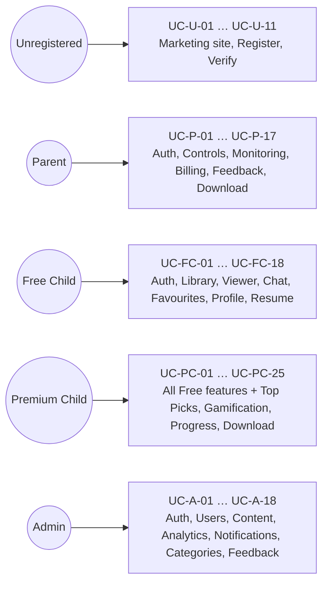

---

# §10.1 — Unregistered User

## UC-U-01: View Subscription Plans

| Field | Value |
|-------|-------|
| **ID** | UC-U-01 |
| **Name** | View Subscription Plans |
| **Primary Actor** | Unregistered User |
| **Story** | §10.1 (1) — "As an unregistered user, I want to view the available subscription plans so that I can decide whether to register." |
| **Preconditions** | Visitor has opened `index.html`. |
| **Postconditions** | Free and Premium plan cards with features and pricing are visible. |
| **Main Flow** | 1. Visitor opens website. 2. Plan cards render from static markup. 3. Visitor compares Free vs. Premium. |
| **Alt Flows** | 3a. Visitor clicks *Get Started* → redirected to Register (UC-U-10). |
| **Exceptions** | — |

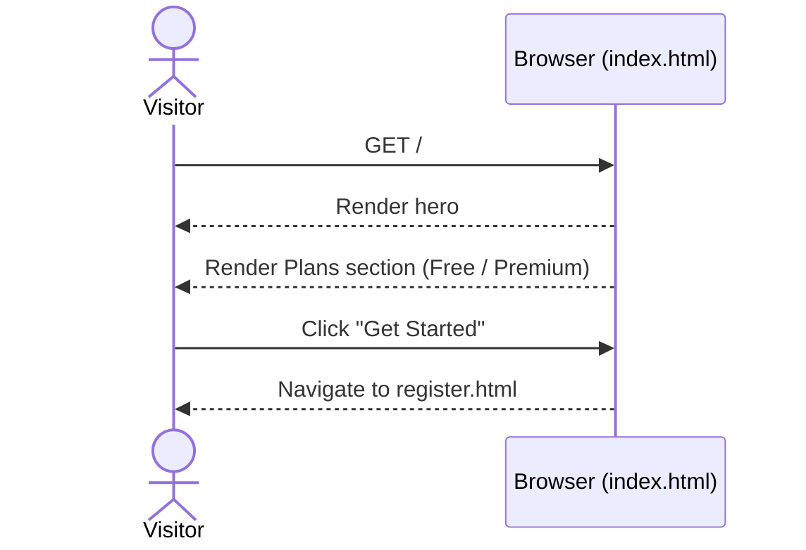

---

## UC-U-02: Read Testimonials

| Field | Value |
|-------|-------|
| **ID** | UC-U-02 |
| **Name** | Read Testimonials |
| **Primary Actor** | Unregistered User |
| **Story** | §10.1 (2) — "As an unregistered user, I want to read testimonials from registered users so that I can evaluate the app's credibility." |
| **Preconditions** | Visitor is on `index.html`. |
| **Postconditions** | Live testimonial slider displays published feedback. |
| **Main Flow** | 1. Page opens. 2. `onSnapshot(feedback where status=="published")` streams testimonials. 3. Slider renders rating + comment + author. |
| **Alt Flows** | — |
| **Exceptions** | 2a. Listener error → placeholder card shown. |

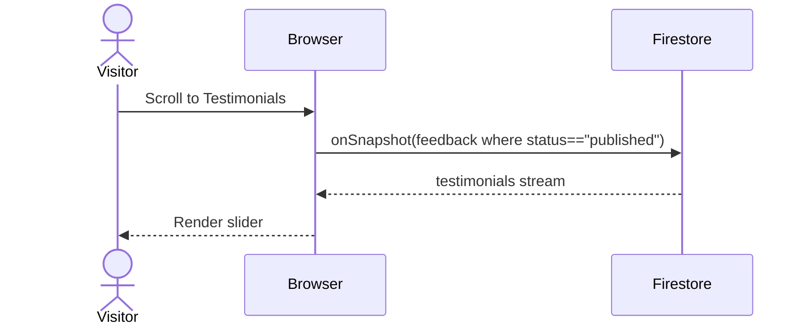

---

## UC-U-03: Learn About App Features

| Field | Value |
|-------|-------|
| **ID** | UC-U-03 |
| **Name** | Learn About App Features |
| **Primary Actor** | Unregistered User |
| **Story** | §10.1 (3) — "As an unregistered user, I want to learn about the app's features so that I understand how it works." |
| **Preconditions** | Visitor is on `index.html`. |
| **Postconditions** | Features section (chatbot, library, parental controls, safety) rendered. |
| **Main Flow** | 1. Visitor scrolls to *Features*. 2. Static tiles describe each feature. |
| **Alt Flows** | — |
| **Exceptions** | — |

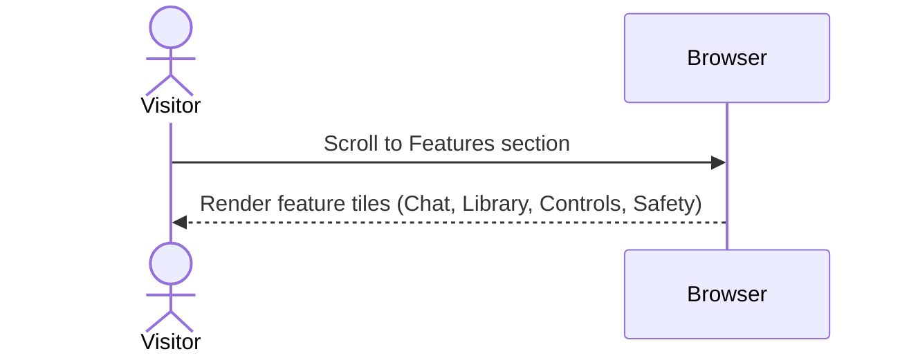

---

## UC-U-04: Preview the App ("Inside the App")

| Field | Value |
|-------|-------|
| **ID** | UC-U-04 |
| **Name** | Preview the App |
| **Primary Actor** | Unregistered User |
| **Story** | §10.1 (4) — "As an unregistered user, I want to preview the application through the 'Inside the App' section so that I can see how it looks and behaves." |
| **Preconditions** | Visitor is on `index.html`. |
| **Postconditions** | Screenshot carousel / animation shown. |
| **Main Flow** | 1. Visitor scrolls to *Inside the App*. 2. Carousel cycles screenshots (chat, library, reader). |
| **Alt Flows** | 2a. Visitor swipes / arrow-clicks to navigate slides. |
| **Exceptions** | — |

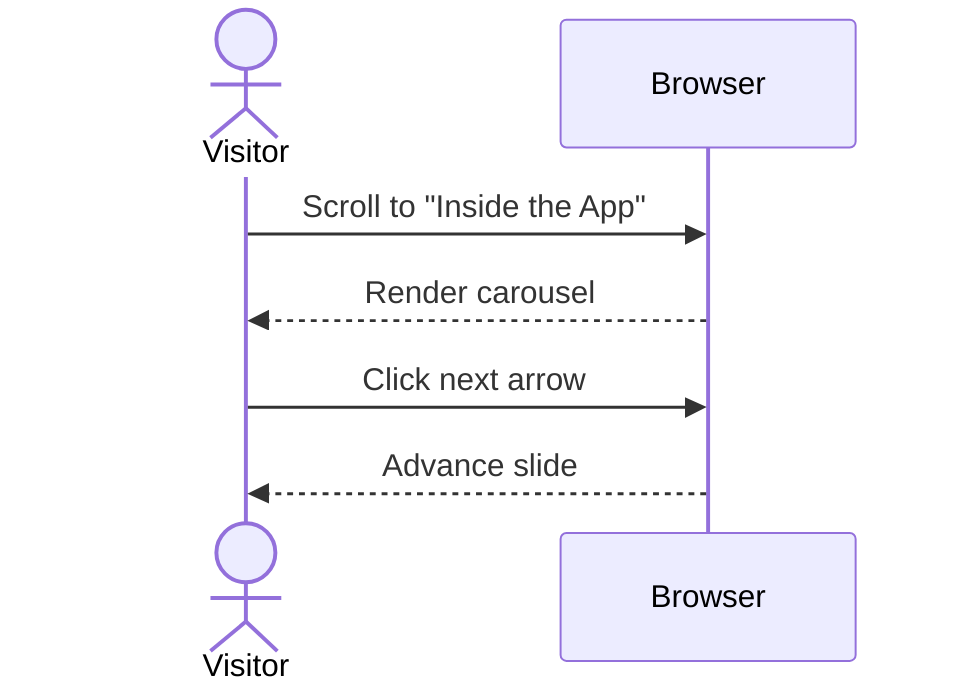

---

## UC-U-05: Learn About Safety Features

| Field | Value |
|-------|-------|
| **ID** | UC-U-05 |
| **Name** | Learn About Safety Features |
| **Primary Actor** | Unregistered User |
| **Story** | §10.1 (5) — "As an unregistered user, I want to learn about the safety features so that I can trust the platform for children." |
| **Preconditions** | Visitor is on `index.html`. |
| **Postconditions** | Safety & parental-controls section rendered. |
| **Main Flow** | 1. Visitor scrolls to *Safety*. 2. Page lists age-rating filter, screen time limit, safe viewer, parental PIN. |
| **Alt Flows** | — |
| **Exceptions** | — |

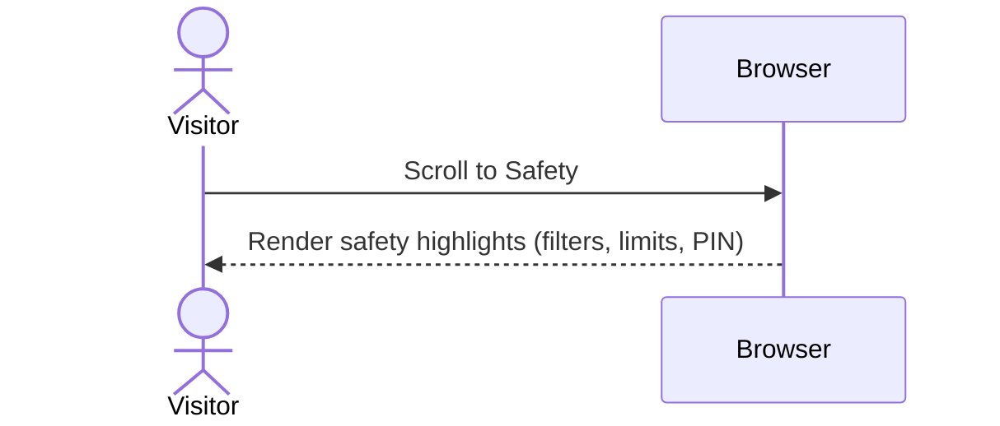

---

## UC-U-06: View Analytics Highlights

| Field | Value |
|-------|-------|
| **ID** | UC-U-06 |
| **Name** | View Analytics Highlights |
| **Primary Actor** | Unregistered User |
| **Story** | §10.1 (6) — "As an unregistered user, I want to view analytics highlights so that I can understand the app's usage and impact." |
| **Preconditions** | Visitor is on `index.html`. |
| **Postconditions** | Impact numbers (families, sessions, hours read) rendered. |
| **Main Flow** | 1. Visitor scrolls to *Impact / Analytics*. 2. Cards display curated counters. |
| **Alt Flows** | — |
| **Exceptions** | — |

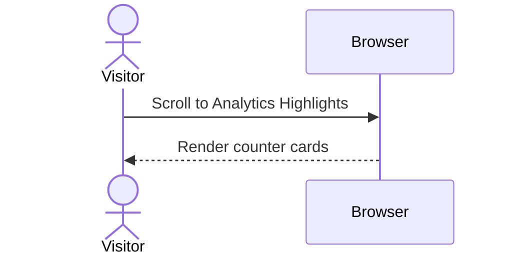

---

## UC-U-07: Read the About Section

| Field | Value |
|-------|-------|
| **ID** | UC-U-07 |
| **Name** | Read About Section |
| **Primary Actor** | Unregistered User |
| **Story** | §10.1 (7) — "As an unregistered user, I want to read the 'About' section so that I can learn more about the application." |
| **Preconditions** | Visitor is on `index.html`. |
| **Postconditions** | Mission, team, and project background displayed. |
| **Main Flow** | 1. Visitor scrolls to *About*. 2. Static copy renders. |
| **Alt Flows** | — |
| **Exceptions** | — |

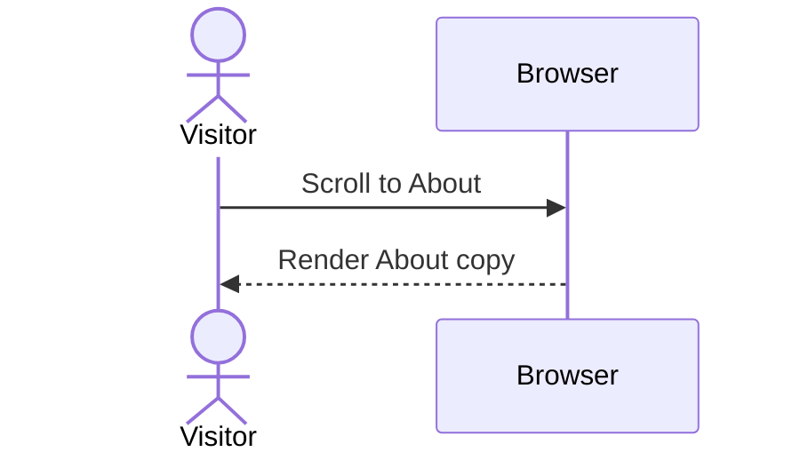

---

## UC-U-08: View Privacy Policy

| Field | Value |
|-------|-------|
| **ID** | UC-U-08 |
| **Name** | View Privacy Policy |
| **Primary Actor** | Unregistered User |
| **Story** | §10.1 (8) — "As an unregistered user, I want to view the privacy policy so that I understand how my data is handled." |
| **Preconditions** | Visitor is on the site. |
| **Postconditions** | `privacy.html` rendered. |
| **Main Flow** | 1. Visitor clicks *Privacy* link in footer. 2. Browser loads `privacy.html`. |
| **Alt Flows** | — |
| **Exceptions** | — |

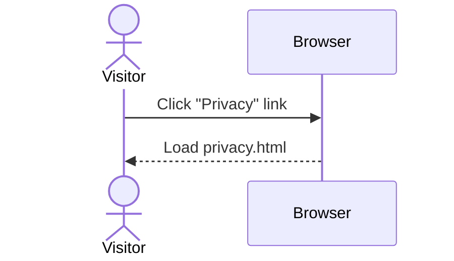

---

## UC-U-09: Access Contact Section

| Field | Value |
|-------|-------|
| **ID** | UC-U-09 |
| **Name** | Access Contact Section |
| **Primary Actor** | Unregistered User |
| **Story** | §10.1 (9) — "As an unregistered user, I want to access the contact section so that I can reach out for support or inquiries." |
| **Preconditions** | Visitor is on `index.html`. |
| **Postconditions** | Contact form / email link visible; on submit, inquiry stored. |
| **Main Flow** | 1. Visitor scrolls to *Contact*. 2. Visitor fills form (name, email, message). 3. Submit → `contactMessages/{id}` written. 4. "Thanks" toast. |
| **Alt Flows** | 2a. Click mailto link → open mail client. |
| **Exceptions** | 3a. Write failure → inline error. |

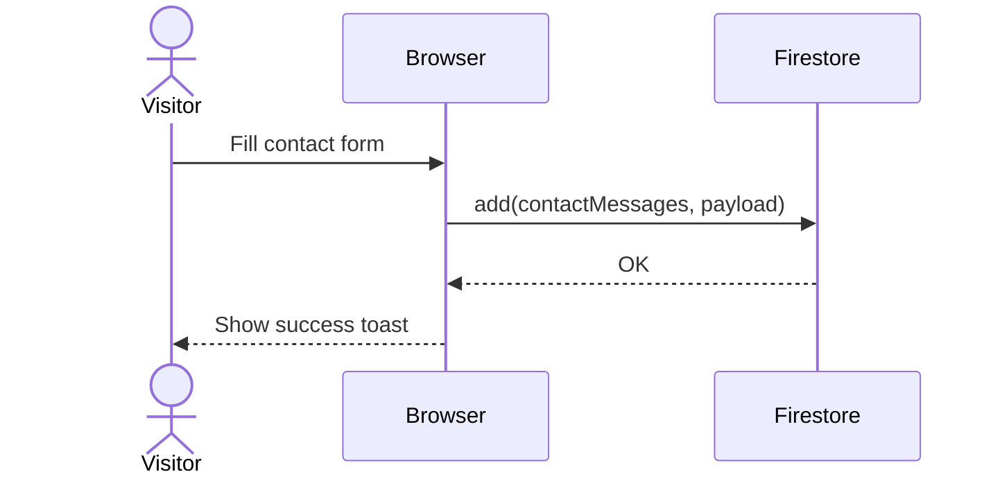

---

## UC-U-10: Register Parent Account

| Field | Value |
|-------|-------|
| **ID** | UC-U-10 |
| **Name** | Register Parent Account |
| **Primary Actor** | Unregistered User |
| **Story** | §10.1 (10) — "As an unregistered user, I want to register a parent account so that I can gain access to the Little Dino app." |
| **Preconditions** | Visitor is on the Register screen and selects *Parent*. |
| **Postconditions** | Firebase Auth user created; `users/{uid}` with `accountType=PARENT`; verification email sent. |
| **Main Flow** | 1. Visitor submits name/email/password. 2. `AuthViewModel.signUpParent` → `AccountManager.signUpParent`. 3. `createUserWithEmailAndPassword`. 4. `sendEmailVerification`. 5. Firestore write parent doc. 6. State → `EmailNotVerified`. |
| **Alt Flows** | — |
| **Exceptions** | 3a. Email collision / weak password → mapped error; rollback on Firestore failure. |

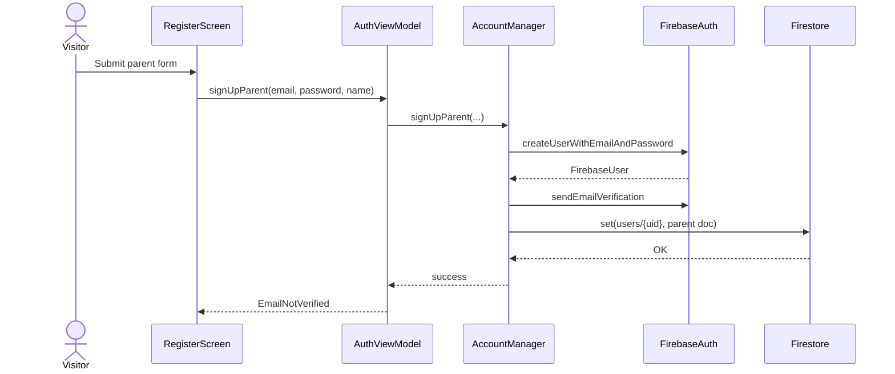

---

## UC-U-11: Verify Account

| Field | Value |
|-------|-------|
| **ID** | UC-U-11 |
| **Name** | Verify Account via Email |
| **Primary Actor** | Unregistered User → Registered Parent |
| **Story** | §10.1 (11) — "As an unregistered user, I want to verify my account so that I can securely activate access." |
| **Preconditions** | Parent registered; verification email sent. |
| **Postconditions** | `FirebaseUser.isEmailVerified == true`; state → `Authenticated`. |
| **Main Flow** | 1. User clicks link in email. 2. Returns to app, taps *I've verified*. 3. `AuthViewModel.checkEmailVerified` → `reload()`. 4. On verified → route to Parent Dashboard. |
| **Alt Flows** | 2a. Tap *Resend* → `AccountManager.resendVerificationEmail`. |
| **Exceptions** | 3a. Still unverified → "Email not yet verified." |

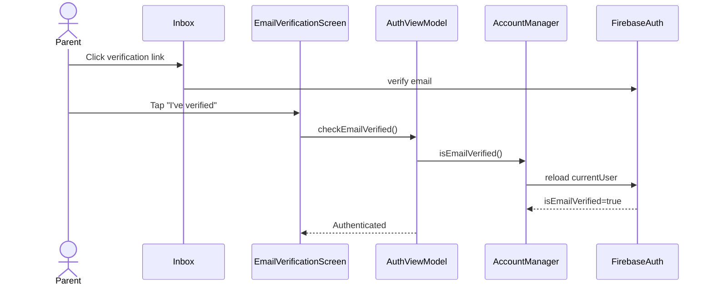

---

# §10.2 — Registered Parent

## UC-P-01: Log In

| Field | Value |
|-------|-------|
| **ID** | UC-P-01 |
| **Name** | Parent Log In |
| **Primary Actor** | Registered Parent |
| **Story** | §10.2 (1) — "As a registered parent user, I want to log in securely so that I can access parental controls." |
| **Preconditions** | Parent has a verified account. |
| **Postconditions** | `AuthState.Authenticated`; routed to Parent Dashboard. |
| **Main Flow** | 1. Parent enters email + password. 2. `AuthViewModel.signIn` → `AccountManager.signIn`. 3. Firebase Auth signs in. 4. `trackLoginAttempt`. 5. User doc loaded → Parent Dashboard. |
| **Alt Flows** | 5a. Unverified → redirect to Verify (UC-U-11). 5b. Status SUSPENDED/BANNED → sign out + block. |
| **Exceptions** | 3a. Invalid credentials → error. |

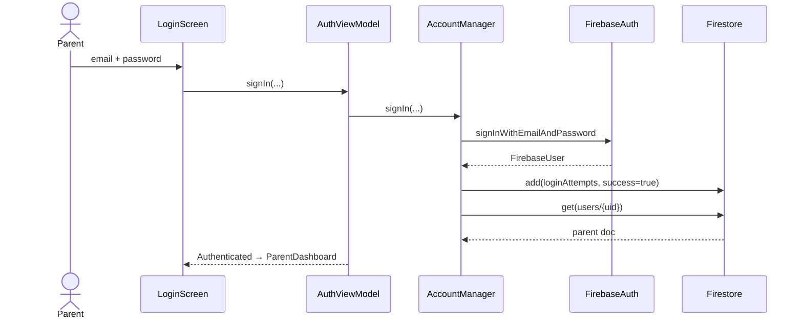

---

## UC-P-02: Log Out

| Field | Value |
|-------|-------|
| **ID** | UC-P-02 |
| **Name** | Parent Log Out |
| **Primary Actor** | Registered Parent |
| **Story** | §10.2 (2) — "As a registered parent user, I want to log out securely so that my account remains protected." |
| **Preconditions** | Parent authenticated. |
| **Postconditions** | Session cleared; state → `Unauthenticated`; UI returns to Login. |
| **Main Flow** | 1. Parent taps Logout. 2. `AuthViewModel.signOut` clears state. 3. `AccountManager.signOut` → `FirebaseAuth.signOut`. 4. Navigate to Login. |
| **Alt Flows** | — |
| **Exceptions** | — |

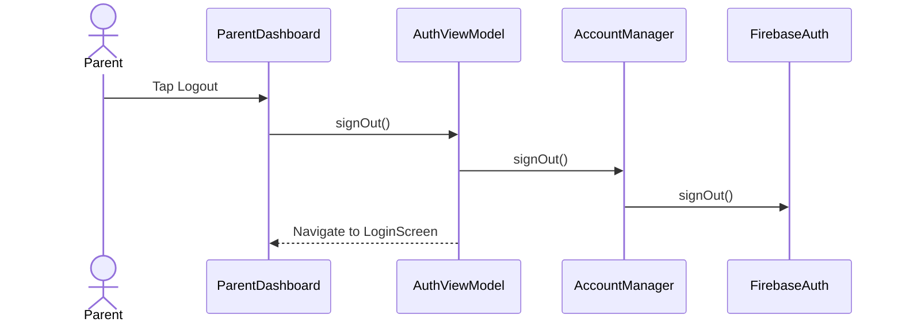

---

## UC-P-03: Generate 6-Digit Invite Code

| Field | Value |
|-------|-------|
| **ID** | UC-P-03 |
| **Name** | Generate Child Invite Code |
| **Primary Actor** | Registered Parent |
| **Story** | §10.2 (3) — "As a registered parent user, I want to generate a 6-pin code so that my child can create an account securely." |
| **Preconditions** | Parent authenticated and verified. |
| **Postconditions** | `inviteCodes/{CODE}` created with 24 h expiry; code shown to parent. |
| **Main Flow** | 1. Parent taps *Generate Code*. 2. Picks interests + starter books. 3. `AccountManager.generateInviteCode` produces unique 6-char code. 4. `inviteCodes/{CODE}` written with `parentId`, `expiresAt=+24h`. 5. Code displayed. |
| **Alt Flows** | — |
| **Exceptions** | 3a. 5 collision retries fail → error. |

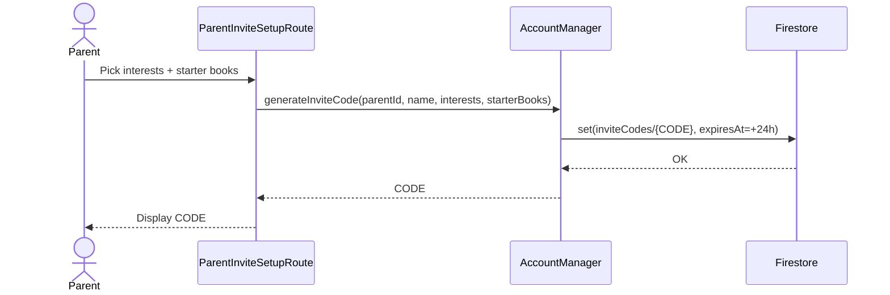

---

## UC-P-04: Manage Multiple Child Profiles

| Field | Value |
|-------|-------|
| **ID** | UC-P-04 |
| **Name** | Manage Multiple Child Profiles |
| **Primary Actor** | Registered Parent |
| **Story** | §10.2 (4) — "As a registered parent user, I want to manage multiple child profiles so that I can monitor each child individually." |
| **Preconditions** | Parent authenticated; 0+ children linked. |
| **Postconditions** | Active child selected; dashboard scoped to that child. |
| **Main Flow** | 1. Parent opens Dashboard. 2. `ParentDashboardViewModel` calls `getChildrenFlow(parentId)`. 3. List of child tiles rendered. 4. Parent selects a child → `selectChild(childId)`. 5. Downstream streams rebind to the selected child. |
| **Alt Flows** | 1a. No children → CTA to generate invite code (UC-P-03). |
| **Exceptions** | — |

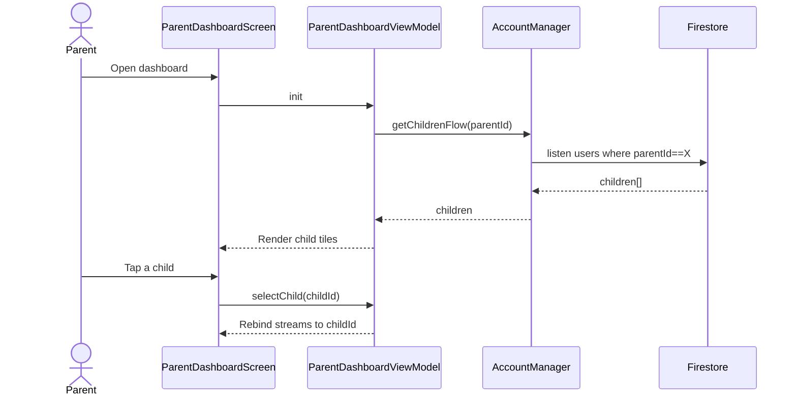

---

## UC-P-05: Set Maximum Age Rating

| Field | Value |
|-------|-------|
| **ID** | UC-P-05 |
| **Name** | Set Maximum Age Rating |
| **Primary Actor** | Registered Parent |
| **Story** | §10.2 (5) — "As a registered parent user, I want to set a maximum age rating so that my child only accesses age-appropriate content." |
| **Preconditions** | Parent authenticated; child selected. |
| **Postconditions** | `users/{childId}.contentFilters.maxAgeRating` updated; library & chat honour the cap. |
| **Main Flow** | 1. Parent opens *Parental Controls*. 2. Drags age slider. 3. `AccountManager.updateChildFilters(childId, maxAge=…)`. 4. Firestore update. |
| **Alt Flows** | — |
| **Exceptions** | 3a. Write failure → toast + retry. |

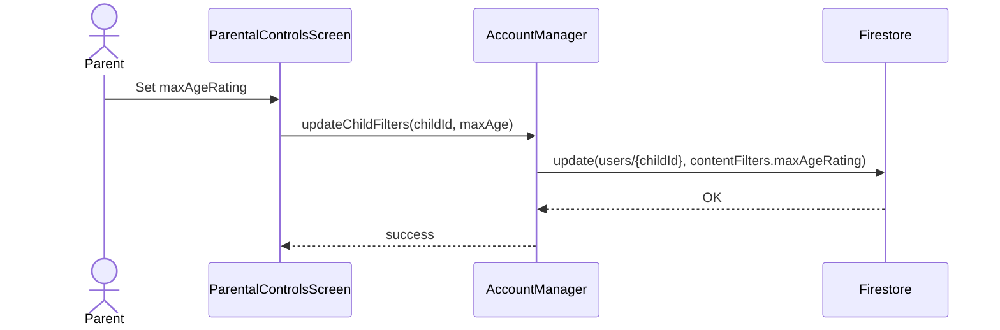

---

## UC-P-06: Enable / Disable Video Content

| Field | Value |
|-------|-------|
| **ID** | UC-P-06 |
| **Name** | Toggle Video Content |
| **Primary Actor** | Registered Parent |
| **Story** | §10.2 (6) — "As a registered parent user, I want to enable or disable video content so that I can control screen exposure." |
| **Preconditions** | Parent authenticated; child selected. |
| **Postconditions** | `users/{childId}.contentFilters.allowVideos` updated; child UI hides video rails when disabled. |
| **Main Flow** | 1. Parent toggles *Allow Videos* switch. 2. `AccountManager.updateChildFilters(childId, allowVideos=…)`. 3. Firestore update. |
| **Alt Flows** | — |
| **Exceptions** | — |

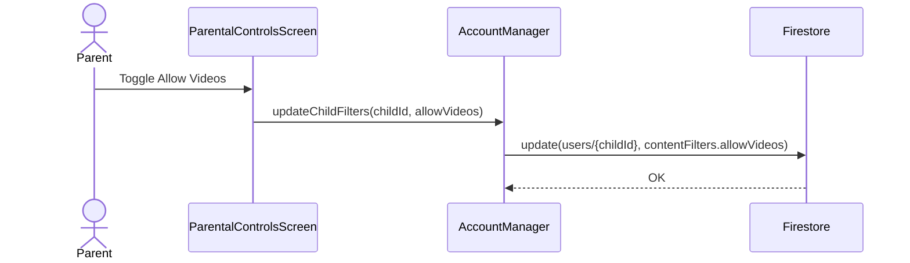

---

## UC-P-07: Set Daily Screen-Time Limit

| Field | Value |
|-------|-------|
| **ID** | UC-P-07 |
| **Name** | Set Daily Screen-Time Limit |
| **Primary Actor** | Registered Parent |
| **Story** | §10.2 (7) — "As a registered parent user, I want to set daily screen time limits so that I can control usage duration." |
| **Preconditions** | Parent authenticated; child selected. |
| **Postconditions** | `users/{childId}.screenTimeConfig.dailyLimitMinutes` updated. |
| **Main Flow** | 1. Parent opens *Parental Controls* → Screen Time. 2. Sets daily limit (minutes). 3. `ScreenTimeManager.updateConfig` → Firestore update. |
| **Alt Flows** | 2a. Parent also sets warning threshold. |
| **Exceptions** | — |

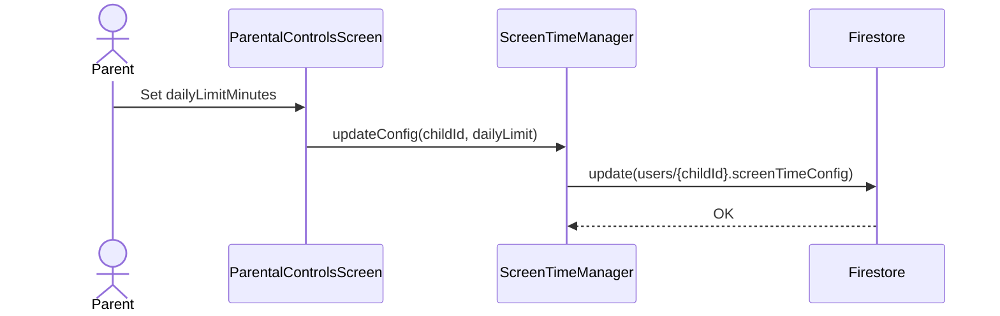

---

## UC-P-08: Enforce Limit When Reached

| Field | Value |
|-------|-------|
| **ID** | UC-P-08 |
| **Name** | Enforce Daily Limit |
| **Primary Actor** | Registered Parent (policy owner); Child (affected) |
| **Story** | §10.2 (8) — "As a registered parent user, I want the app to restrict access when the limit is reached so that usage is enforced." |
| **Preconditions** | Child's `screenTimeConfig.isEnabled=true` and `dailyLimitMinutes > 0`. |
| **Postconditions** | When today's minutes ≥ limit, `ScreenTimeWrapper` displays a lock screen and blocks navigation. |
| **Main Flow** | 1. Child uses app. 2. `ScreenTimeWrapper` observes `screenTimeSessions/{childId}` + `screenTimeConfig`. 3. On threshold reached → show `ScreenTimeLockDialog`. 4. Parent receives notification (UC-P-15). |
| **Alt Flows** | — |
| **Exceptions** | — |

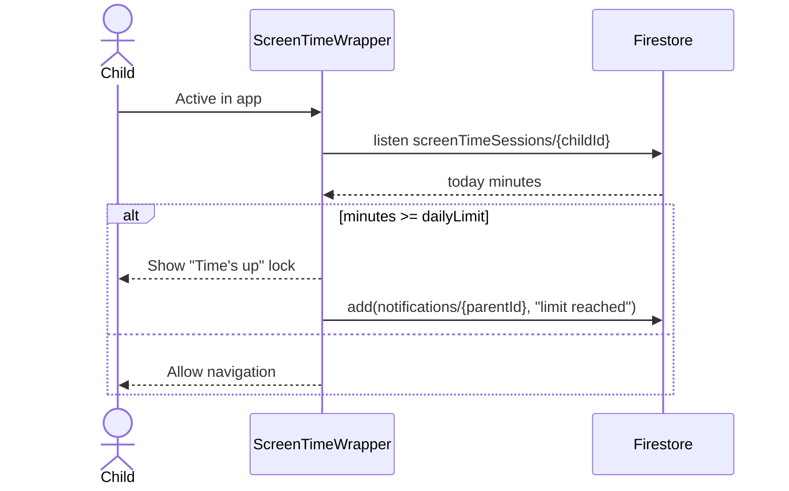

---

## UC-P-09: View Child's Activity History

| Field | Value |
|-------|-------|
| **ID** | UC-P-09 |
| **Name** | View Activity History |
| **Primary Actor** | Registered Parent |
| **Story** | §10.2 (9) — "As a registered parent user, I want to view my child's activity history so that I can track usage." |
| **Preconditions** | Parent authenticated; child selected. |
| **Postconditions** | `readingHistory/{childId}/sessions` rendered chronologically. |
| **Main Flow** | 1. Parent opens Dashboard → *Activity* tab. 2. `getChildReadingHistoryFlow(childId)` streams sessions. 3. List rendered by `openedAt desc`. |
| **Alt Flows** | — |
| **Exceptions** | 2a. Empty → "No activity yet." |

```mermaid
sequenceDiagram
    actor P as Parent
    participant PD as ParentDashboardScreen
    participant AM as AccountManager
    participant FS as Firestore
    P->>PD: Open Activity tab
    PD->>AM: getChildReadingHistoryFlow(childId)
    AM->>FS: listen readingHistory/{childId}/sessions
    FS-->>AM: sessions
    AM-->>PD: list
    PD-->>P: Render activity
```

---

## UC-P-10: View Child's Favourites

| Field | Value |
|-------|-------|
| **ID** | UC-P-10 |
| **Name** | View Child's Favourites |
| **Primary Actor** | Registered Parent |
| **Story** | §10.2 (10) — "As a registered parent user, I want to view my child's favourites so that I can understand their interests." |
| **Preconditions** | Parent authenticated; child selected. |
| **Postconditions** | `favorites/{childId}/items` rendered. |
| **Main Flow** | 1. Parent opens *Favourites* tab. 2. `getChildFavoritesFlow(childId)` streams. 3. Cards rendered. |
| **Alt Flows** | — |
| **Exceptions** | — |

```mermaid
sequenceDiagram
    actor P as Parent
    participant PD as ParentDashboardScreen
    participant AM as AccountManager
    participant FS as Firestore
    P->>PD: Open Favourites tab
    PD->>AM: getChildFavoritesFlow(childId)
    AM->>FS: listen favorites/{childId}/items
    FS-->>AM: favourites
    PD-->>P: Render cards
```

---

## UC-P-11: View Chatbot Interactions

| Field | Value |
|-------|-------|
| **ID** | UC-P-11 |
| **Name** | View Chatbot Interactions |
| **Primary Actor** | Registered Parent |
| **Story** | §10.2 (11) — "As a registered parent user, I want to view chatbot interactions so that I can monitor recommendations." |
| **Preconditions** | Parent authenticated; child selected. |
| **Postconditions** | `chatMessages/{childId}` transcripts rendered. |
| **Main Flow** | 1. Parent opens *Chat* tab. 2. Dashboard listens to `chatMessages/{childId}`. 3. Ordered transcript rendered. |
| **Alt Flows** | — |
| **Exceptions** | — |

```mermaid
sequenceDiagram
    actor P as Parent
    participant PD as ParentDashboardScreen
    participant FS as Firestore
    P->>PD: Open Chat tab
    PD->>FS: listen chatMessages/{childId}
    FS-->>PD: messages
    PD-->>P: Render transcript
```

---

## UC-P-12: View Reading Progress

| Field | Value |
|-------|-------|
| **ID** | UC-P-12 |
| **Name** | View Reading Progress |
| **Primary Actor** | Registered Parent |
| **Story** | §10.2 (12) — "As a registered parent user, I want to view my child's reading progress so that I can track engagement." |
| **Preconditions** | Parent authenticated; child selected. |
| **Postconditions** | Progress summary shown (books finished, minutes read, streak). |
| **Main Flow** | 1. Parent opens *Progress* tab. 2. `ParentProgressViewModel` reads `learningProgressEvents/{childId}` + `gamificationProfile/{childId}`. 3. Summary rendered. |
| **Alt Flows** | — |
| **Exceptions** | — |

```mermaid
sequenceDiagram
    actor P as Parent
    participant PP as ParentProgressSection
    participant PVM as ParentProgressViewModel
    participant FS as Firestore
    P->>PP: Open Progress tab
    PP->>PVM: loadProgress(childId)
    PVM->>FS: read learningProgressEvents, gamificationProfile
    FS-->>PVM: data
    PVM-->>PP: summary
    PP-->>P: Render progress
```

---

## UC-P-13: Upgrade Child to Premium

| Field | Value |
|-------|-------|
| **ID** | UC-P-13 |
| **Name** | Upgrade Child Account to Premium |
| **Primary Actor** | Registered Parent |
| **Story** | §10.2 (13) — "As a registered parent user, I want to upgrade my child's account to premium so that they can access advanced features." |
| **Preconditions** | Target child is on FREE. |
| **Postconditions** | `users/{childId}.planType = PREMIUM`. |
| **Main Flow** | 1. Parent taps *Upgrade*. 2. `PremiumUpgradeScreen` → `BillingManager.launchBillingFlow`. 3. On purchase success → `AuthViewModel.upgradeCurrentUserToPremium` → `AccountManager.upgradeToPremium(childId)`. 4. Firestore update. |
| **Alt Flows** | 2a. Parent cancels → state unchanged. |
| **Exceptions** | 4a. Write fails → retry on next launch. |

```mermaid
sequenceDiagram
    actor P as Parent
    participant PS as PremiumUpgradeScreen
    participant BM as BillingManager
    participant Play as Google Play Billing
    participant VM as AuthViewModel
    participant AM as AccountManager
    participant FS as Firestore
    P->>PS: Tap Upgrade
    PS->>BM: launchBillingFlow()
    BM->>Play: Purchase
    Play-->>BM: success
    BM-->>PS: onPaymentSuccess
    PS->>VM: upgradeCurrentUserToPremium()
    VM->>AM: upgradeToPremium(childId)
    AM->>FS: update(users/{childId}, planType=PREMIUM)
    FS-->>AM: OK
```

---

## UC-P-14: Manage Payments

| Field | Value |
|-------|-------|
| **ID** | UC-P-14 |
| **Name** | Manage Payments |
| **Primary Actor** | Registered Parent |
| **Story** | §10.2 (14) — "As a registered parent user, I want to manage payments securely so that billing is controlled." |
| **Preconditions** | Parent authenticated. |
| **Postconditions** | Parent routed to Google Play's subscription management. |
| **Main Flow** | 1. Parent opens *Billing*. 2. `BillingViewModel.queryPurchases` shows active subscription. 3. Parent taps *Manage* → deep-link to Play Store subscriptions. |
| **Alt Flows** | 3a. Parent cancels subscription in Play → on next purchase check, plan reverts to FREE at period end. |
| **Exceptions** | — |

```mermaid
sequenceDiagram
    actor P as Parent
    participant PS as PaymentScreen
    participant BVM as BillingViewModel
    participant Play as Google Play
    P->>PS: Open Billing
    PS->>BVM: queryPurchases()
    BVM-->>PS: active subscription
    P->>PS: Tap Manage
    PS->>Play: Open subscriptions deep link
```

---

## UC-P-15: Receive Notifications

| Field | Value |
|-------|-------|
| **ID** | UC-P-15 |
| **Name** | Receive Notifications |
| **Primary Actor** | Registered Parent |
| **Story** | §10.2 (15) — "As a registered parent user, I want to receive notifications (e.g., screen limit reached) so that I stay informed." |
| **Preconditions** | Parent authenticated; FCM token stored. |
| **Postconditions** | `notifications/{parentId}/items/{id}` inserted; announcement dialog shown; after dismissal `read=true`. |
| **Main Flow** | 1. Event fires (screen-limit reached, admin broadcast). 2. Writer inserts `notifications/{parentId}/items`. 3. `NotificationsViewModel` snapshot. 4. Dialog shows unread. 5. Parent dismisses → `markRead`. |
| **Alt Flows** | 1a. FCM push while backgrounded. |
| **Exceptions** | 3a. Listener error → silent retry. |

```mermaid
sequenceDiagram
    participant Src as ScreenTimeWrapper / Admin
    participant FS as Firestore
    participant NVM as NotificationsViewModel
    actor P as Parent
    participant UI as AnnouncementDialog
    Src->>FS: add(notifications/{parentId}/items)
    FS-->>NVM: snapshot
    NVM-->>UI: unread list
    UI-->>P: Show dialog
    P->>UI: Tap "Got it!"
    UI->>NVM: markRead(id)
    NVM->>FS: update(read=true)
```

---

## UC-P-16: Manage Feedback

| Field | Value |
|-------|-------|
| **ID** | UC-P-16 |
| **Name** | Submit / Edit / Delete Own Feedback |
| **Primary Actor** | Registered Parent |
| **Story** | §10.2 (16) — "As a registered parent user, I want to manage my feedback so that I can edit or delete." |
| **Preconditions** | Parent authenticated. |
| **Postconditions** | `feedback/{id}` created / updated / deleted. |
| **Main Flow** | 1. Parent opens Feedback form. 2. Submits rating + comment → `add(feedback, {userId, status:"published"})`. 3. Edit: `update(feedback/{id})`. 4. Delete: `deleteDoc(feedback/{id})` when `userId==uid`. |
| **Alt Flows** | — |
| **Exceptions** | 2a. Write error → inline message. |

```mermaid
sequenceDiagram
    actor P as Parent
    participant FD as FeedbackDialog
    participant FM as FeedbackManager
    participant FS as Firestore
    P->>FD: Submit rating + comment
    FD->>FM: submit(feedback)
    FM->>FS: add(feedback, payload)
    P->>FD: Edit
    FD->>FM: update(id, ...)
    FM->>FS: update(feedback/{id})
    P->>FD: Delete
    FD->>FM: delete(id)
    FM->>FS: delete(feedback/{id})
```

---

## UC-P-17: Download LittleDino App

| Field | Value |
|-------|-------|
| **ID** | UC-P-17 |
| **Name** | Download App from Website |
| **Primary Actor** | Registered Parent |
| **Story** | §10.2 (17) — "As a registered parent user, I want to download the LittleDino app from the website." |
| **Preconditions** | Parent is on the website. |
| **Postconditions** | Google Play listing opened. |
| **Main Flow** | 1. Parent clicks *Download on Google Play* badge. 2. Browser opens Play Store listing. |
| **Alt Flows** | — |
| **Exceptions** | — |

```mermaid
sequenceDiagram
    actor P as Parent
    participant W as Browser
    participant GP as Google Play
    P->>W: Click "Download on Google Play"
    W->>GP: Open listing
```

---

# §10.3 — Registered Child (Free)

## UC-FC-01: Log In

| Field | Value |
|-------|-------|
| **ID** | UC-FC-01 |
| **Name** | Free Child Log In |
| **Primary Actor** | Free Child |
| **Story** | §10.3 (1) — "As a free registered child user, I want to log in so that I can securely access the platform." |
| **Preconditions** | Child account exists. |
| **Postconditions** | `AuthState.Authenticated`; routed to Chat home. |
| **Main Flow** | 1. Child enters credentials. 2. `signIn` → `AccountManager.signIn`. 3. Firebase signs in. 4. User doc → route to Chat. |
| **Alt Flows** | — |
| **Exceptions** | 2a. Invalid credentials → error + failed attempt logged. |

```mermaid
sequenceDiagram
    actor C as Child
    participant LS as LoginScreen
    participant VM as AuthViewModel
    participant AM as AccountManager
    participant FA as FirebaseAuth
    C->>LS: email + password
    LS->>VM: signIn(...)
    VM->>AM: signIn(...)
    AM->>FA: signInWithEmailAndPassword
    FA-->>AM: FirebaseUser
    VM-->>LS: Authenticated → DinoChatPage
```

---

## UC-FC-02: Log Out

| Field | Value |
|-------|-------|
| **ID** | UC-FC-02 |
| **Name** | Free Child Log Out |
| **Primary Actor** | Free Child |
| **Story** | §10.3 (2) — "As a free registered child user, I want to log out so that I can securely exit." |
| **Preconditions** | Child authenticated. |
| **Postconditions** | Session cleared; return to Login. |
| **Main Flow** | 1. Child taps Logout. 2. `AuthViewModel.signOut` clears state. 3. `AccountManager.signOut`. 4. Navigate to Login. |
| **Alt Flows** | — |
| **Exceptions** | — |

```mermaid
sequenceDiagram
    actor C as Child
    participant UI as Profile
    participant VM as AuthViewModel
    participant AM as AccountManager
    participant FA as FirebaseAuth
    C->>UI: Tap Logout
    UI->>VM: signOut()
    VM->>AM: signOut()
    AM->>FA: signOut()
    VM-->>UI: Navigate to LoginScreen
```

---

## UC-FC-03: Browse Library

| Field | Value |
|-------|-------|
| **ID** | UC-FC-03 |
| **Name** | Browse the Book Library |
| **Primary Actor** | Free Child |
| **Story** | §10.3 (3) — "As a free registered child user, I want to browse the library so that I can discover books." |
| **Preconditions** | Child authenticated. |
| **Postconditions** | First page of books displayed. |
| **Main Flow** | 1. Child opens *Library*. 2. `LibraryViewModel.loadBooks(reset=true)` queries `content_books orderBy(title) limit(20)`. 3. Grid renders. 4. *Load More* → `startAfter(lastDoc)`. |
| **Alt Flows** | — |
| **Exceptions** | 2a. Query error → fallback no-results. |

```mermaid
sequenceDiagram
    actor C as Child
    participant UL as UserLibraryScreen
    participant LVM as LibraryViewModel
    participant FS as Firestore
    C->>UL: Open Library
    UL->>LVM: loadBooks(reset=true)
    LVM->>FS: query(content_books, limit=20)
    FS-->>LVM: page 1
    LVM-->>UL: Render grid
    C->>UL: Load More
    UL->>LVM: loadBooks(reset=false)
    LVM->>FS: startAfter(lastDoc)
    FS-->>LVM: page 2
```

---

## UC-FC-04: Open Book in Safe Viewer

| Field | Value |
|-------|-------|
| **ID** | UC-FC-04 |
| **Name** | Open Book in Safe Viewer |
| **Primary Actor** | Free Child |
| **Story** | §10.3 (4) — "As a free registered child user, I want to open a book in a safe viewer so that I can read within the app." |
| **Preconditions** | Child tapped a book card. |
| **Postconditions** | `BookReaderScreen` (or `SafeWebViewScreen`) renders the book inside the app. |
| **Main Flow** | 1. Child taps a book. 2. `buildContentRoute` classifies URL → reader. 3. `ProfileViewModel.trackReading` logs open event. 4. Book rendered. 5. On close → `AnalyticsRepository.trackDropOffPoint`. |
| **Alt Flows** | 2a. Blank URL → popBackStack. |
| **Exceptions** | — |

```mermaid
sequenceDiagram
    actor C as Child
    participant NAV as AppNavigation
    participant R as BookReaderScreen
    participant PVM as ProfileViewModel
    participant AR as AnalyticsRepository
    participant FS as Firestore
    C->>NAV: Tap book card
    NAV->>NAV: buildContentRoute(url)
    NAV->>PVM: trackReading(title, url, false)
    PVM->>FS: add(readingHistory/{uid}/sessions, openedAt)
    NAV->>R: navigate(reader)
    R-->>C: Render book
    C->>R: Close
    R->>AR: trackDropOffPoint(...)
    AR->>FS: add(dropOffEvents)
```

---

## UC-FC-05: Watch Videos in Safe Viewer

| Field | Value |
|-------|-------|
| **ID** | UC-FC-05 |
| **Name** | Watch Video in Safe Viewer |
| **Primary Actor** | Free Child |
| **Story** | §10.3 (5) — "As a free registered child user, I want to watch videos in a safe viewer so that I only access approved content." |
| **Preconditions** | `contentFilters.allowVideos=true`; child tapped a video card. |
| **Postconditions** | `YouTubePlayerScreen` plays approved video; drop-off tracked. |
| **Main Flow** | 1. Child taps video. 2. `buildContentRoute` → YouTube → `YouTubePlayerScreen`. 3. `trackReading(..., isVideo=true)`. 4. Player renders in-app. 5. Close → drop-off event. |
| **Alt Flows** | 1a. If `allowVideos=false`, video rail hidden (UC-P-06). |
| **Exceptions** | — |

```mermaid
sequenceDiagram
    actor C as Child
    participant NAV as AppNavigation
    participant YP as YouTubePlayerScreen
    participant PVM as ProfileViewModel
    participant AR as AnalyticsRepository
    participant FS as Firestore
    C->>NAV: Tap video card
    NAV->>NAV: buildContentRoute(url, isVideo=true)
    NAV->>PVM: trackReading(title, url, true)
    PVM->>FS: add(readingHistory, isVideo=true)
    NAV->>YP: navigate(player)
    YP-->>C: Play video
    C->>YP: Close
    YP->>AR: trackDropOffPoint(...)
```

---

## UC-FC-06: Chat with AI Chatbot

| Field | Value |
|-------|-------|
| **ID** | UC-FC-06 |
| **Name** | Chat with Little Dino |
| **Primary Actor** | Free Child |
| **Story** | §10.3 (6) — "As a free registered child user, I want to chat with the AI chatbot so that I can get personalized recommendations." |
| **Preconditions** | Daily quota of 5 not exhausted. |
| **Postconditions** | User + bot messages persisted; recommendations rendered. |
| **Main Flow** | 1. Child types prompt. 2. `ChatViewModel.send` checks `ChatQuotaManager.canSend(uid, FREE)`. 3. Allowed → `RecommendationRepository.personalizedFor`. 4. Persist `chatMessages/{uid}`. 5. Bot reply rendered. |
| **Alt Flows** | 2a. Over quota → message + upgrade prompt. |
| **Exceptions** | 3a. No results → fallback reply. |

```mermaid
sequenceDiagram
    actor C as Child
    participant UI as DinoChatPage
    participant CVM as ChatViewModel
    participant Q as ChatQuotaManager
    participant RR as RecommendationRepository
    participant FS as Firestore
    C->>UI: Send prompt
    UI->>CVM: send(prompt)
    CVM->>Q: canSend(uid, FREE)
    alt over quota
        Q-->>CVM: false
        CVM-->>UI: "Daily limit reached"
    else allowed
        Q-->>CVM: true
        CVM->>RR: personalizedFor(prompt, uid)
        RR-->>CVM: recs
        CVM->>FS: add(chatMessages, user+bot)
        CVM->>Q: increment(uid)
        CVM-->>UI: Render reply
    end
```

---

## UC-FC-07: Use Text-to-Speech

| Field | Value |
|-------|-------|
| **ID** | UC-FC-07 |
| **Name** | Text-to-Speech |
| **Primary Actor** | Free Child |
| **Story** | §10.3 (7) — "As a free registered child user, I want to use text-to-speech so that interaction is easier." |
| **Preconditions** | Message rendered in chat. |
| **Postconditions** | `TextToSpeechService` speaks the message audio. |
| **Main Flow** | 1. Child taps speaker icon on a bot bubble. 2. `DinoChatPage` → `TextToSpeechService.speak(text)`. 3. Audio plays. |
| **Alt Flows** | 1a. Child taps stop → `TextToSpeechService.stop()`. |
| **Exceptions** | 2a. TTS engine unavailable → silent no-op. |

```mermaid
sequenceDiagram
    actor C as Child
    participant UI as DinoChatPage
    participant TTS as TextToSpeechService
    C->>UI: Tap speaker icon
    UI->>TTS: speak(replyText)
    TTS-->>C: audio
    C->>UI: Tap stop
    UI->>TTS: stop()
```

---

## UC-FC-08: Start a New Chat

| Field | Value |
|-------|-------|
| **ID** | UC-FC-08 |
| **Name** | Start New Chat Session |
| **Primary Actor** | Free Child |
| **Story** | §10.3 (8) — "As a free registered child user, I want to start a new chat so that I can explore new topics." |
| **Preconditions** | Child authenticated. |
| **Postconditions** | New `sessionId` begins; fresh context. |
| **Main Flow** | 1. Child taps *New Chat*. 2. `ChatViewModel.newSession()` generates `sessionId`. 3. UI clears current messages. |
| **Alt Flows** | — |
| **Exceptions** | — |

```mermaid
sequenceDiagram
    actor C as Child
    participant UI as DinoChatPage
    participant CVM as ChatViewModel
    C->>UI: Tap "New Chat"
    UI->>CVM: newSession()
    CVM-->>UI: Clear messages, new sessionId
```

---

## UC-FC-09: View Chat History

| Field | Value |
|-------|-------|
| **ID** | UC-FC-09 |
| **Name** | View Chat History |
| **Primary Actor** | Free Child |
| **Story** | §10.3 (9) — "As a free registered child user, I want to view chat history so that I can revisit recommendations." |
| **Preconditions** | Child authenticated and has prior messages. |
| **Postconditions** | Sessions list displayed. |
| **Main Flow** | 1. Child opens History. 2. `ChatViewModel.loadHistory()` reads `chatMessages/{uid}` grouped by `sessionId`. 3. Sessions rendered. 4. Tap a session → messages restored. |
| **Alt Flows** | — |
| **Exceptions** | — |

```mermaid
sequenceDiagram
    actor C as Child
    participant UI as DinoChatPage
    participant CVM as ChatViewModel
    participant FS as Firestore
    C->>UI: Open History
    UI->>CVM: loadHistory()
    CVM->>FS: query(chatMessages/{uid}, orderBy sentAt)
    FS-->>CVM: messages
    CVM-->>UI: Render sessions
    C->>UI: Tap session
    UI-->>C: Restore messages
```

---

## UC-FC-10: Add to Favourites

| Field | Value |
|-------|-------|
| **ID** | UC-FC-10 |
| **Name** | Add Favourite |
| **Primary Actor** | Free Child |
| **Story** | §10.3 (10) — "As a free registered child user, I want to add items to favourites so that I can save what I like." |
| **Preconditions** | Child authenticated; item not already favourite. |
| **Postconditions** | `favorites/{uid}/items/{itemId}` created. |
| **Main Flow** | 1. Child taps heart. 2. `FavoritesViewModel.toggle(item)` inspects plan + count. 3. Free limit (2 books + 2 videos) enforced. 4. `FavoritesManager.add` → Firestore. |
| **Alt Flows** | — |
| **Exceptions** | 3a. Over limit → upgrade prompt, no write. |

```mermaid
sequenceDiagram
    actor C as Child
    participant UI as Card
    participant FVM as FavoritesViewModel
    participant FM as FavoritesManager
    participant FS as Firestore
    C->>UI: Tap heart
    UI->>FVM: toggle(item)
    FVM->>FVM: check plan + count
    alt at limit
        FVM-->>UI: Upgrade prompt
    else allowed
        FVM->>FM: add(item)
        FM->>FS: set(favorites/{uid}/items/{itemId})
        FS-->>FM: OK
        FVM-->>UI: Heart filled
    end
```

---

## UC-FC-11: Remove from Favourites

| Field | Value |
|-------|-------|
| **ID** | UC-FC-11 |
| **Name** | Remove Favourite |
| **Primary Actor** | Free Child |
| **Story** | §10.3 (11) — "As a free registered child user, I want to remove items from favourites so that I can manage my list." |
| **Preconditions** | Item currently favourited. |
| **Postconditions** | `favorites/{uid}/items/{itemId}` deleted. |
| **Main Flow** | 1. Child taps filled heart. 2. `FavoritesViewModel.toggle(item)` detects existing → delete. 3. `FavoritesManager.remove` → Firestore. |
| **Alt Flows** | — |
| **Exceptions** | — |

```mermaid
sequenceDiagram
    actor C as Child
    participant UI as Card
    participant FVM as FavoritesViewModel
    participant FM as FavoritesManager
    participant FS as Firestore
    C->>UI: Tap filled heart
    UI->>FVM: toggle(item)
    FVM->>FM: remove(itemId)
    FM->>FS: delete(favorites/{uid}/items/{itemId})
    FS-->>FM: OK
    FVM-->>UI: Heart empty
```

---

## UC-FC-12: Set Interests

| Field | Value |
|-------|-------|
| **ID** | UC-FC-12 |
| **Name** | Set Interests |
| **Primary Actor** | Free Child |
| **Story** | §10.3 (12) — "As a free registered child user, I want to set my interests so that recommendations improve." |
| **Preconditions** | Child authenticated. |
| **Postconditions** | `users/{uid}.interests` updated; recommender uses new list. |
| **Main Flow** | 1. Child opens Profile → Interests chips. 2. Toggles chips. 3. `ProfileViewModel.saveProfile` → `AccountManager.updateUser`. |
| **Alt Flows** | — |
| **Exceptions** | — |

```mermaid
sequenceDiagram
    actor C as Child
    participant PS as ProfileScreen
    participant PVM as ProfileViewModel
    participant AM as AccountManager
    participant FS as Firestore
    C->>PS: Toggle interest chips
    PS->>PVM: saveProfile(user with new interests)
    PVM->>AM: updateUser(user)
    AM->>FS: set(users/{uid}, interests)
    FS-->>AM: OK
```

---

## UC-FC-13: Set Reading Level

| Field | Value |
|-------|-------|
| **ID** | UC-FC-13 |
| **Name** | Set Reading Level |
| **Primary Actor** | Free Child |
| **Story** | §10.3 (13) — "As a free registered child user, I want to set my reading level so that content matches my ability." |
| **Preconditions** | Child authenticated. |
| **Postconditions** | `users/{uid}.readingLevel` updated. |
| **Main Flow** | 1. Child opens Profile → Reading Level. 2. Picks level. 3. `saveProfile` → `updateUser`. |
| **Alt Flows** | — |
| **Exceptions** | — |

```mermaid
sequenceDiagram
    actor C as Child
    participant PS as ProfileScreen
    participant PVM as ProfileViewModel
    participant AM as AccountManager
    participant FS as Firestore
    C->>PS: Select reading level
    PS->>PVM: saveProfile(readingLevel)
    PVM->>AM: updateUser(user)
    AM->>FS: set(users/{uid}, readingLevel)
    FS-->>AM: OK
```

---

## UC-FC-14: Edit Profile

| Field | Value |
|-------|-------|
| **ID** | UC-FC-14 |
| **Name** | Edit Profile |
| **Primary Actor** | Free Child |
| **Story** | §10.3 (14) — "As a free registered child user, I want to edit my profile so that my details stay updated." |
| **Preconditions** | Child authenticated. |
| **Postconditions** | `users/{uid}` updated with new name/age/avatar. |
| **Main Flow** | 1. Child opens Profile → *Edit*. 2. Updates fields. 3. `saveProfile` → `updateUser`. |
| **Alt Flows** | — |
| **Exceptions** | 3a. Write fails → toast, form stays open. |

```mermaid
sequenceDiagram
    actor C as Child
    participant PS as ProfileScreen
    participant PVM as ProfileViewModel
    participant AM as AccountManager
    participant FS as Firestore
    C->>PS: Edit name/age/avatar
    PS->>PVM: saveProfile(user)
    PVM->>AM: updateUser(user)
    AM->>FS: set(users/{uid}, user)
    FS-->>AM: OK
    PVM-->>PS: Saved toast
```

---

## UC-FC-15: View Recent Activity

| Field | Value |
|-------|-------|
| **ID** | UC-FC-15 |
| **Name** | View Recent Activity |
| **Primary Actor** | Free Child |
| **Story** | §10.3 (15) — "As a free registered child user, I want to view my recent activity so that I can track what I explored." |
| **Preconditions** | Child has reading history. |
| **Postconditions** | Recent items rendered. |
| **Main Flow** | 1. Child opens Profile. 2. `ProfileViewModel.loadRecent()` → `readingHistory/{uid}/sessions orderBy openedAt desc`. 3. List rendered. |
| **Alt Flows** | — |
| **Exceptions** | 2a. Empty → "Nothing yet." |

```mermaid
sequenceDiagram
    actor C as Child
    participant PS as ProfileScreen
    participant PVM as ProfileViewModel
    participant FS as Firestore
    C->>PS: Open Profile
    PS->>PVM: loadRecent()
    PVM->>FS: query(readingHistory/{uid}/sessions orderBy openedAt desc)
    FS-->>PVM: sessions
    PVM-->>PS: Render Recent list
```

---

## UC-FC-16: Search Books in Library

| Field | Value |
|-------|-------|
| **ID** | UC-FC-16 |
| **Name** | Search Books |
| **Primary Actor** | Free Child |
| **Story** | §10.3 (16) — "As a free registered child user, I want to search for books in 'Library' so that I can find content easily." |
| **Preconditions** | Child in Library. |
| **Postconditions** | Matching books rendered. |
| **Main Flow** | 1. Child types query in `SmartSearchBar`. 2. `SmartSearchViewModel.search(query)` fetches matches from `content_books` (client-side title filter). 3. Grid re-renders. |
| **Alt Flows** | — |
| **Exceptions** | 2a. No matches → "No books found." |

```mermaid
sequenceDiagram
    actor C as Child
    participant UL as UserLibraryScreen
    participant SSV as SmartSearchViewModel
    participant FS as Firestore
    C->>UL: Type query
    UL->>SSV: search(query)
    SSV->>FS: query(content_books)
    FS-->>SSV: results
    SSV-->>UL: Filter by title
    UL-->>C: Render results
```

---

## UC-FC-17: Filter Books by Category

| Field | Value |
|-------|-------|
| **ID** | UC-FC-17 |
| **Name** | Filter by Category |
| **Primary Actor** | Free Child |
| **Story** | §10.3 (17) — "As a free registered child user, I want to filter books by category so that I can explore my interests." |
| **Preconditions** | Child in Library. |
| **Postconditions** | Books restricted to selected category. |
| **Main Flow** | 1. Child picks category chip. 2. `LibraryViewModel.applyFilters(category=…)` → `query(content_books where category==…)`. 3. Grid re-renders. |
| **Alt Flows** | 1a. Clear filter → full list restored. |
| **Exceptions** | — |

```mermaid
sequenceDiagram
    actor C as Child
    participant UL as UserLibraryScreen
    participant LVM as LibraryViewModel
    participant FS as Firestore
    C->>UL: Select category chip
    UL->>LVM: applyFilters(category)
    LVM->>FS: query(content_books where category==X)
    FS-->>LVM: books
    LVM-->>UL: Render filtered grid
```

---

## UC-FC-18: Continue From Where I Left Off

| Field | Value |
|-------|-------|
| **ID** | UC-FC-18 |
| **Name** | Continue Reading |
| **Primary Actor** | Free Child |
| **Story** | §10.3 (18) — "As a free registered child user, I want to continue from where I left off so that I can resume easily." |
| **Preconditions** | Child has prior reading session. |
| **Postconditions** | Safe viewer reopens most recent item. |
| **Main Flow** | 1. Child taps *Continue* card on Chat home. 2. `ProfileViewModel.loadRecent()` gets top entry. 3. `buildContentRoute` reopens in the same viewer used before. |
| **Alt Flows** | 2a. No recent → card hidden. |
| **Exceptions** | — |

```mermaid
sequenceDiagram
    actor C as Child
    participant UI as DinoChatPage
    participant PVM as ProfileViewModel
    participant FS as Firestore
    participant NAV as AppNavigation
    C->>UI: Tap "Continue" card
    UI->>PVM: loadRecent()
    PVM->>FS: query(readingHistory limit 1 orderBy openedAt desc)
    FS-->>PVM: last session
    PVM-->>UI: lastItem
    UI->>NAV: buildContentRoute(url, isVideo)
    NAV-->>C: Reopen in safe viewer
```

---

# §10.4 — Registered Child (Premium)

## UC-PC-01: Log In

| Field | Value |
|-------|-------|
| **ID** | UC-PC-01 |
| **Name** | Premium Child Log In |
| **Primary Actor** | Premium Child |
| **Story** | §10.4 (1) — "As a premium registered child user, I want to log in so that I can securely access the platform." |
| **Preconditions** | Premium child account exists. |
| **Postconditions** | `AuthState.Authenticated`; routed to Chat home with Premium features enabled. |
| **Main Flow** | Same as UC-FC-01 with `planType=PREMIUM` loaded; Premium rails (top picks, badges) become visible. |
| **Alt Flows** | — |
| **Exceptions** | 2a. Invalid credentials → error. |

```mermaid
sequenceDiagram
    actor C as Premium Child
    participant LS as LoginScreen
    participant VM as AuthViewModel
    participant AM as AccountManager
    participant FA as FirebaseAuth
    participant FS as Firestore
    C->>LS: email + password
    LS->>VM: signIn(...)
    VM->>AM: signIn(...)
    AM->>FA: signInWithEmailAndPassword
    FA-->>AM: FirebaseUser
    AM->>FS: get(users/{uid}) (planType=PREMIUM)
    VM-->>LS: Authenticated → DinoChatPage (Premium)
```

---

## UC-PC-02: Log Out

| Field | Value |
|-------|-------|
| **ID** | UC-PC-02 |
| **Name** | Premium Child Log Out |
| **Primary Actor** | Premium Child |
| **Story** | §10.4 (2) — "As a premium registered child user, I want to log out so that I can securely exit." |
| **Preconditions** | Child authenticated. |
| **Postconditions** | Session cleared; return to Login. |
| **Main Flow** | Same as UC-FC-02. |
| **Alt Flows** | — |
| **Exceptions** | — |

```mermaid
sequenceDiagram
    actor C as Premium Child
    participant UI as Profile
    participant VM as AuthViewModel
    participant AM as AccountManager
    participant FA as FirebaseAuth
    C->>UI: Tap Logout
    UI->>VM: signOut()
    VM->>AM: signOut()
    AM->>FA: signOut()
    VM-->>UI: Navigate to LoginScreen
```

---

## UC-PC-03: Browse Library

| Field | Value |
|-------|-------|
| **ID** | UC-PC-03 |
| **Name** | Browse Library (Premium) |
| **Primary Actor** | Premium Child |
| **Story** | §10.4 (3) — "As a premium registered child user, I want to browse the library so that I can discover books." |
| **Preconditions** | Child authenticated. |
| **Postconditions** | Library grid rendered; no free caps. |
| **Main Flow** | Identical to UC-FC-03; Premium sees additional *Top Picks* rail (UC-PC-19). |
| **Alt Flows** | — |
| **Exceptions** | — |

```mermaid
sequenceDiagram
    actor C as Premium Child
    participant UL as UserLibraryScreen
    participant LVM as LibraryViewModel
    participant FS as Firestore
    C->>UL: Open Library
    UL->>LVM: loadBooks(reset=true)
    LVM->>FS: query(content_books, limit=20)
    FS-->>LVM: books
    LVM-->>UL: Render grid
```

---

## UC-PC-04: Open Book in Safe Viewer

| Field | Value |
|-------|-------|
| **ID** | UC-PC-04 |
| **Name** | Open Book (Premium) |
| **Primary Actor** | Premium Child |
| **Story** | §10.4 (4) — "As a premium registered child user, I want to open a book in a safe viewer so that I can read within the app." |
| **Preconditions** | Child tapped a book card. |
| **Postconditions** | Same as UC-FC-04; additionally feeds `GamificationManager` for session tracking. |
| **Main Flow** | Same as UC-FC-04; on close a `reading_session` event is emitted to `GamificationRepository.onEvent` (UC-PC-23). |
| **Alt Flows** | — |
| **Exceptions** | — |

```mermaid
sequenceDiagram
    actor C as Premium Child
    participant NAV as AppNavigation
    participant R as BookReaderScreen
    participant PVM as ProfileViewModel
    participant GR as GamificationRepository
    C->>NAV: Tap book card
    NAV->>PVM: trackReading(title, url, false)
    NAV->>R: navigate(reader)
    R-->>C: Render book
    C->>R: Close
    R->>GR: onEvent(uid, "reading_session", itemId)
```

---

## UC-PC-05: Watch Videos in Safe Viewer

| Field | Value |
|-------|-------|
| **ID** | UC-PC-05 |
| **Name** | Watch Video (Premium) |
| **Primary Actor** | Premium Child |
| **Story** | §10.4 (5) — "As a premium registered child user, I want to watch videos in a safe viewer so that I only access approved content." |
| **Preconditions** | `allowVideos=true`. |
| **Postconditions** | Video rendered; gamification session emitted on close. |
| **Main Flow** | Same as UC-FC-05; additionally feeds gamification. |
| **Alt Flows** | — |
| **Exceptions** | — |

```mermaid
sequenceDiagram
    actor C as Premium Child
    participant NAV as AppNavigation
    participant YP as YouTubePlayerScreen
    participant PVM as ProfileViewModel
    participant GR as GamificationRepository
    C->>NAV: Tap video card
    NAV->>PVM: trackReading(title, url, true)
    NAV->>YP: navigate(player)
    YP-->>C: Play video
    C->>YP: Close
    YP->>GR: onEvent(uid, "video_session", itemId)
```

---

## UC-PC-06: Chat with AI Chatbot

| Field | Value |
|-------|-------|
| **ID** | UC-PC-06 |
| **Name** | Chat (Premium) |
| **Primary Actor** | Premium Child |
| **Story** | §10.4 (6) — "As a premium registered child user, I want to chat with the AI chatbot so that I can get personalized recommendations." |
| **Preconditions** | Child authenticated. |
| **Postconditions** | Messages persisted; Premium recs include relevance scores. |
| **Main Flow** | 1. Child sends prompt. 2. `ChatViewModel.send` — Premium bypasses quota. 3. `RecommendationRepository.personalizedFor` returns ranked items. 4. Persist messages. 5. Reply rendered. |
| **Alt Flows** | — |
| **Exceptions** | 3a. No results → fallback. |

```mermaid
sequenceDiagram
    actor C as Premium Child
    participant UI as DinoChatPage
    participant CVM as ChatViewModel
    participant RR as RecommendationRepository
    participant FS as Firestore
    C->>UI: Send prompt
    UI->>CVM: send(prompt)
    CVM->>RR: personalizedFor(prompt, uid)
    RR-->>CVM: ranked recs
    CVM->>FS: add(chatMessages, user+bot)
    CVM-->>UI: Render reply
```

---

## UC-PC-07: Use Text-to-Speech

| Field | Value |
|-------|-------|
| **ID** | UC-PC-07 |
| **Name** | Text-to-Speech (Premium) |
| **Primary Actor** | Premium Child |
| **Story** | §10.4 (7) — "As a premium registered child user, I want to use text-to-speech so that interaction is easier." |
| **Preconditions** | Chat reply visible. |
| **Postconditions** | Audio playback of reply. |
| **Main Flow** | Same as UC-FC-07. |
| **Alt Flows** | — |
| **Exceptions** | — |

```mermaid
sequenceDiagram
    actor C as Premium Child
    participant UI as DinoChatPage
    participant TTS as TextToSpeechService
    C->>UI: Tap speaker icon
    UI->>TTS: speak(replyText)
    TTS-->>C: audio
```

---

## UC-PC-08: Start a New Chat

| Field | Value |
|-------|-------|
| **ID** | UC-PC-08 |
| **Name** | New Chat (Premium) |
| **Primary Actor** | Premium Child |
| **Story** | §10.4 (8) — "As a premium registered child user, I want to start a new chat so that I can explore new topics." |
| **Preconditions** | Child authenticated. |
| **Postconditions** | Fresh `sessionId`. |
| **Main Flow** | Same as UC-FC-08. |
| **Alt Flows** | — |
| **Exceptions** | — |

```mermaid
sequenceDiagram
    actor C as Premium Child
    participant UI as DinoChatPage
    participant CVM as ChatViewModel
    C->>UI: Tap "New Chat"
    UI->>CVM: newSession()
    CVM-->>UI: Clear + new sessionId
```

---

## UC-PC-09: View Chat History

| Field | Value |
|-------|-------|
| **ID** | UC-PC-09 |
| **Name** | Chat History (Premium) |
| **Primary Actor** | Premium Child |
| **Story** | §10.4 (9) — "As a premium registered child user, I want to view chat history so that I can revisit recommendations." |
| **Preconditions** | Child has prior sessions. |
| **Postconditions** | Sessions rendered. |
| **Main Flow** | Same as UC-FC-09. |
| **Alt Flows** | — |
| **Exceptions** | — |

```mermaid
sequenceDiagram
    actor C as Premium Child
    participant UI as DinoChatPage
    participant CVM as ChatViewModel
    participant FS as Firestore
    C->>UI: Open History
    UI->>CVM: loadHistory()
    CVM->>FS: query(chatMessages/{uid} orderBy sentAt)
    FS-->>CVM: messages
    CVM-->>UI: Render sessions
```

---

## UC-PC-10: Add to Favourites

| Field | Value |
|-------|-------|
| **ID** | UC-PC-10 |
| **Name** | Add Favourite (Premium) |
| **Primary Actor** | Premium Child |
| **Story** | §10.4 (10) — "As a premium registered child user, I want to add items to favourites so that I can save what I like." |
| **Preconditions** | Child authenticated. |
| **Postconditions** | `favorites/{uid}/items/{itemId}` created — no quota cap for Premium. |
| **Main Flow** | Same as UC-FC-10 but `FavoritesViewModel.toggle` skips the free-tier limit check. |
| **Alt Flows** | — |
| **Exceptions** | — |

```mermaid
sequenceDiagram
    actor C as Premium Child
    participant UI as Card
    participant FVM as FavoritesViewModel
    participant FM as FavoritesManager
    participant FS as Firestore
    C->>UI: Tap heart
    UI->>FVM: toggle(item)
    FVM->>FM: add(item)
    FM->>FS: set(favorites/{uid}/items/{itemId})
    FS-->>FM: OK
    FVM-->>UI: Heart filled
```

---

## UC-PC-11: Remove from Favourites

| Field | Value |
|-------|-------|
| **ID** | UC-PC-11 |
| **Name** | Remove Favourite (Premium) |
| **Primary Actor** | Premium Child |
| **Story** | §10.4 (11) — "As a premium registered child user, I want to remove items from favourites so that I can manage my list." |
| **Preconditions** | Item favourited. |
| **Postconditions** | Favourite deleted. |
| **Main Flow** | Same as UC-FC-11. |
| **Alt Flows** | — |
| **Exceptions** | — |

```mermaid
sequenceDiagram
    actor C as Premium Child
    participant UI as Card
    participant FVM as FavoritesViewModel
    participant FM as FavoritesManager
    participant FS as Firestore
    C->>UI: Tap filled heart
    UI->>FVM: toggle(item)
    FVM->>FM: remove(itemId)
    FM->>FS: delete(favorites/{uid}/items/{itemId})
    FS-->>FM: OK
```

---

## UC-PC-12: Set Interests

| Field | Value |
|-------|-------|
| **ID** | UC-PC-12 |
| **Name** | Set Interests (Premium) |
| **Primary Actor** | Premium Child |
| **Story** | §10.4 (12) — "As a premium registered child user, I want to set my interests so that recommendations improve." |
| **Preconditions** | Child authenticated. |
| **Postconditions** | `interests` updated; Top Picks re-ranks on next load. |
| **Main Flow** | Same as UC-FC-12. |
| **Alt Flows** | — |
| **Exceptions** | — |

```mermaid
sequenceDiagram
    actor C as Premium Child
    participant PS as ProfileScreen
    participant PVM as ProfileViewModel
    participant AM as AccountManager
    participant FS as Firestore
    C->>PS: Toggle interest chips
    PS->>PVM: saveProfile(interests)
    PVM->>AM: updateUser(user)
    AM->>FS: set(users/{uid}, interests)
```

---

## UC-PC-13: Set Reading Level

| Field | Value |
|-------|-------|
| **ID** | UC-PC-13 |
| **Name** | Set Reading Level (Premium) |
| **Primary Actor** | Premium Child |
| **Story** | §10.4 (13) — "As a premium registered child user, I want to set my reading level so that content matches my ability." |
| **Preconditions** | Child authenticated. |
| **Postconditions** | `readingLevel` updated; recommender adjusts. |
| **Main Flow** | Same as UC-FC-13. |
| **Alt Flows** | — |
| **Exceptions** | — |

```mermaid
sequenceDiagram
    actor C as Premium Child
    participant PS as ProfileScreen
    participant PVM as ProfileViewModel
    participant AM as AccountManager
    participant FS as Firestore
    C->>PS: Select reading level
    PS->>PVM: saveProfile(readingLevel)
    PVM->>AM: updateUser(user)
    AM->>FS: set(users/{uid}, readingLevel)
```

---

## UC-PC-14: Edit Profile

| Field | Value |
|-------|-------|
| **ID** | UC-PC-14 |
| **Name** | Edit Profile (Premium) |
| **Primary Actor** | Premium Child |
| **Story** | §10.4 (14) — "As a premium registered child user, I want to edit my profile so that my details stay updated." |
| **Preconditions** | Child authenticated. |
| **Postconditions** | `users/{uid}` updated. |
| **Main Flow** | Same as UC-FC-14. |
| **Alt Flows** | — |
| **Exceptions** | — |

```mermaid
sequenceDiagram
    actor C as Premium Child
    participant PS as ProfileScreen
    participant PVM as ProfileViewModel
    participant AM as AccountManager
    participant FS as Firestore
    C->>PS: Edit name/age/avatar
    PS->>PVM: saveProfile(user)
    PVM->>AM: updateUser(user)
    AM->>FS: set(users/{uid}, user)
```

---

## UC-PC-15: View Recent Activity

| Field | Value |
|-------|-------|
| **ID** | UC-PC-15 |
| **Name** | Recent Activity (Premium) |
| **Primary Actor** | Premium Child |
| **Story** | §10.4 (15) — "As a premium registered child user, I want to view my recent activity so that I can track what I explored." |
| **Preconditions** | Child has reading history. |
| **Postconditions** | Recent list rendered. |
| **Main Flow** | Same as UC-FC-15. |
| **Alt Flows** | — |
| **Exceptions** | — |

```mermaid
sequenceDiagram
    actor C as Premium Child
    participant PS as ProfileScreen
    participant PVM as ProfileViewModel
    participant FS as Firestore
    C->>PS: Open Profile
    PS->>PVM: loadRecent()
    PVM->>FS: query(readingHistory orderBy openedAt desc)
    FS-->>PVM: sessions
    PVM-->>PS: Render list
```

---

## UC-PC-16: Search Books

| Field | Value |
|-------|-------|
| **ID** | UC-PC-16 |
| **Name** | Search Books (Premium) |
| **Primary Actor** | Premium Child |
| **Story** | §10.4 (16) — "As a premium registered child user, I want to search for books so that I can find content easily." |
| **Preconditions** | Child in Library. |
| **Postconditions** | Matches rendered. |
| **Main Flow** | Same as UC-FC-16. |
| **Alt Flows** | — |
| **Exceptions** | — |

```mermaid
sequenceDiagram
    actor C as Premium Child
    participant UL as UserLibraryScreen
    participant SSV as SmartSearchViewModel
    participant FS as Firestore
    C->>UL: Type query
    UL->>SSV: search(query)
    SSV->>FS: query(content_books)
    FS-->>SSV: results
    UL-->>C: Render results
```

---

## UC-PC-17: Filter Books by Category

| Field | Value |
|-------|-------|
| **ID** | UC-PC-17 |
| **Name** | Filter by Category (Premium) |
| **Primary Actor** | Premium Child |
| **Story** | §10.4 (17) — "As a premium registered child user, I want to filter books by category so that I can explore my interests." |
| **Preconditions** | Child in Library. |
| **Postconditions** | Filtered grid. |
| **Main Flow** | Same as UC-FC-17. |
| **Alt Flows** | — |
| **Exceptions** | — |

```mermaid
sequenceDiagram
    actor C as Premium Child
    participant UL as UserLibraryScreen
    participant LVM as LibraryViewModel
    participant FS as Firestore
    C->>UL: Select category chip
    UL->>LVM: applyFilters(category)
    LVM->>FS: query(content_books where category==X)
    FS-->>LVM: books
    LVM-->>UL: Render filtered grid
```

---

## UC-PC-18: Continue From Where I Left Off

| Field | Value |
|-------|-------|
| **ID** | UC-PC-18 |
| **Name** | Continue Reading (Premium) |
| **Primary Actor** | Premium Child |
| **Story** | §10.4 (18) — "As a premium registered child user, I want to continue from where I left off so that I can resume easily." |
| **Preconditions** | Prior reading session exists. |
| **Postconditions** | Viewer reopens. |
| **Main Flow** | Same as UC-FC-18. |
| **Alt Flows** | — |
| **Exceptions** | — |

```mermaid
sequenceDiagram
    actor C as Premium Child
    participant UI as DinoChatPage
    participant PVM as ProfileViewModel
    participant FS as Firestore
    participant NAV as AppNavigation
    C->>UI: Tap "Continue"
    UI->>PVM: loadRecent()
    PVM->>FS: query(readingHistory limit 1)
    FS-->>PVM: last session
    UI->>NAV: buildContentRoute(...)
    NAV-->>C: Reopen in safe viewer
```

---

## UC-PC-19: View Personalised Top Picks

| Field | Value |
|-------|-------|
| **ID** | UC-PC-19 |
| **Name** | Personalised Top Picks |
| **Primary Actor** | Premium Child |
| **Story** | §10.4 (19) — "As a premium registered child user, I want to view personalized top picks so that I receive better recommendations." |
| **Preconditions** | `planType=PREMIUM`. |
| **Postconditions** | Top-picks rail rendered on Chat home + Library. |
| **Main Flow** | 1. Screen opens. 2. `RecommendationRepository.topPicks(uid)` reads interests, history, progress. 3. `CollaborativeFilteringService` + `RecommendationEngine` rank items. 4. Rail rendered. |
| **Alt Flows** | 1a. Free child — rail hidden. |
| **Exceptions** | 2a. Empty profile → fallback trending. |

```mermaid
sequenceDiagram
    actor C as Premium Child
    participant UI as DinoChatPage
    participant RR as RecommendationRepository
    participant CF as CollaborativeFilteringService
    participant FS as Firestore
    C->>UI: Open home
    UI->>RR: topPicks(uid)
    RR->>FS: read interests/history/progress
    FS-->>RR: data
    RR->>CF: rank(items)
    CF-->>RR: ranked items
    RR-->>UI: Top Picks list
```

---

## UC-PC-20: See Relevance Scores

| Field | Value |
|-------|-------|
| **ID** | UC-PC-20 |
| **Name** | Show Relevance Score |
| **Primary Actor** | Premium Child |
| **Story** | §10.4 (20) — "As a premium registered child user, I want to see relevance scores so that I understand recommendations." |
| **Preconditions** | Top-picks rail visible (UC-PC-19). |
| **Postconditions** | Each card shows a 0–100 relevance badge. |
| **Main Flow** | 1. After UC-PC-19, `CFRecommendation.score` is forwarded to the UI. 2. Card renders badge (e.g., *92% match*). 3. Tooltip explains *based on your interests + reading level*. |
| **Alt Flows** | — |
| **Exceptions** | — |

```mermaid
sequenceDiagram
    actor C as Premium Child
    participant UI as RecommendationCard
    participant RR as RecommendationRepository
    RR-->>UI: items with relevance score
    UI-->>C: Render "92% match" badge
    C->>UI: Hover/tap badge
    UI-->>C: Show tooltip
```

---

## UC-PC-21: Mark Books as Finished

| Field | Value |
|-------|-------|
| **ID** | UC-PC-21 |
| **Name** | Mark Book Finished |
| **Primary Actor** | Premium Child |
| **Story** | §10.4 (21) — "As a premium registered child user, I want to mark books as finished so that I can track progress." |
| **Preconditions** | Book opened in reader. |
| **Postconditions** | `learningProgressEvents` adds `book_completed`; `gamificationProfile.booksFinished` incremented; possible badge unlock. |
| **Main Flow** | 1. Child taps *Finished*. 2. `GamificationRepository.onEvent(uid, "book_completed", itemId)`. 3. Firestore updates points/level/counter. 4. If milestone → `badgeUnlocks/{uid}/{badgeId}`. 5. UI celebrates. |
| **Alt Flows** | — |
| **Exceptions** | — |

```mermaid
sequenceDiagram
    actor C as Premium Child
    participant R as BookReaderScreen
    participant GR as GamificationRepository
    participant FS as Firestore
    C->>R: Tap "Finished"
    R->>GR: onEvent(uid, "book_completed", itemId)
    GR->>FS: update(gamificationProfile, points+, booksFinished+)
    GR->>FS: add(learningProgressEvents)
    opt milestone
        GR->>FS: set(badgeUnlocks/{uid}/{badgeId})
    end
    GR-->>R: updated profile
    R-->>C: RewardCelebration
```

---

## UC-PC-22: Mark Videos as Watched

| Field | Value |
|-------|-------|
| **ID** | UC-PC-22 |
| **Name** | Mark Video Watched |
| **Primary Actor** | Premium Child |
| **Story** | §10.4 (22) — "As a premium registered child user, I want to mark videos as watched so that I can track completion." |
| **Preconditions** | Video opened in player. |
| **Postconditions** | `gamificationProfile.videosWatched` incremented; progress event added. |
| **Main Flow** | 1. Child taps *Mark Watched* on the player. 2. `GamificationRepository.onEvent(uid, "video_watched", itemId)`. 3. Firestore updates. 4. Possible badge unlock. |
| **Alt Flows** | — |
| **Exceptions** | — |

```mermaid
sequenceDiagram
    actor C as Premium Child
    participant YP as YouTubePlayerScreen
    participant GR as GamificationRepository
    participant FS as Firestore
    C->>YP: Tap "Mark Watched"
    YP->>GR: onEvent(uid, "video_watched", itemId)
    GR->>FS: update(gamificationProfile, videosWatched+)
    GR->>FS: add(learningProgressEvents)
    opt milestone
        GR->>FS: set(badgeUnlocks/{uid}/{badgeId})
    end
    GR-->>YP: updated
```

---

## UC-PC-23: Earn Points, Levels and Badges

| Field | Value |
|-------|-------|
| **ID** | UC-PC-23 |
| **Name** | Gamification Rewards |
| **Primary Actor** | Premium Child |
| **Story** | §10.4 (23) — "As a premium registered child user, I want to earn points, levels, and badges so that learning feels rewarding." |
| **Preconditions** | Premium child. |
| **Postconditions** | `gamificationProfile.points/level/streakDays` updated; `badgeUnlocks` written; celebration shown. |
| **Main Flow** | 1. Any completion event (finish book, watch video, reading session, daily streak). 2. `GamificationManager.onEvent` computes new points/level. 3. Firestore updates `gamificationProfile/{uid}`. 4. If threshold crossed → `BadgeUnlock`. 5. `RewardCelebration` UI. |
| **Alt Flows** | 1a. Free child cannot access → navigation gate pops back. |
| **Exceptions** | — |

```mermaid
sequenceDiagram
    actor C as Premium Child
    participant UI as Any action UI
    participant GM as GamificationManager
    participant FS as Firestore
    participant RC as RewardCelebration
    UI->>GM: onEvent(uid, event)
    GM->>FS: update(gamificationProfile, points+, level, streak+)
    opt level up or badge
        GM->>FS: set(badgeUnlocks/{uid}/{badgeId})
        GM-->>RC: show celebration
        RC-->>C: Confetti animation
    end
```

---

## UC-PC-24: View Progress Dashboard

| Field | Value |
|-------|-------|
| **ID** | UC-PC-24 |
| **Name** | Progress Dashboard |
| **Primary Actor** | Premium Child |
| **Story** | §10.4 (24) — "As a premium registered child user, I want to view my progress dashboard so that I can see achievements." |
| **Preconditions** | Premium child. |
| **Postconditions** | Points, level, streak, badges rendered. |
| **Main Flow** | 1. Child opens `BadgesRewardsScreen`. 2. `GamificationViewModel` reads `gamificationProfile/{uid}` + `badgeUnlocks/{uid}`. 3. UI renders. |
| **Alt Flows** | 1a. Free child → navigation pops back. |
| **Exceptions** | — |

```mermaid
sequenceDiagram
    actor C as Premium Child
    participant PD as BadgesRewardsScreen
    participant GVM as GamificationViewModel
    participant FS as Firestore
    C->>PD: Open dashboard
    PD->>GVM: load(uid)
    GVM->>FS: read gamificationProfile/{uid}
    GVM->>FS: read badgeUnlocks/{uid}
    FS-->>GVM: data
    GVM-->>PD: summary
    PD-->>C: Render points / level / badges
```

---

## UC-PC-25: Download LittleDino App

| Field | Value |
|-------|-------|
| **ID** | UC-PC-25 |
| **Name** | Download App (Premium) |
| **Primary Actor** | Premium Child (via parent device) |
| **Story** | §10.4 (25) — "As a premium registered child user, I want to download the LittleDino app from the website." |
| **Preconditions** | User on website. |
| **Postconditions** | Play Store listing opened. |
| **Main Flow** | Same as UC-P-17. |
| **Alt Flows** | — |
| **Exceptions** | — |

```mermaid
sequenceDiagram
    actor U as User
    participant W as Browser
    participant GP as Google Play
    U->>W: Click "Download on Google Play"
    W->>GP: Open listing
```

---

# §10.5 — System Admin

## UC-A-01: Admin Log In

| Field | Value |
|-------|-------|
| **ID** | UC-A-01 |
| **Name** | Admin Log In |
| **Primary Actor** | System Admin |
| **Story** | §10.5 (1) — "As a system admin, I want to log in securely so that I can access admin features." |
| **Preconditions** | Admin credentials. |
| **Postconditions** | Routed to Admin Console. |
| **Main Flow** | 1. Admin enters email + password. 2. `AuthViewModel.signIn`. 3. Firebase signs in. 4. Admin email bypasses verification gate. 5. Route to `AdminScreen`. |
| **Alt Flows** | — |
| **Exceptions** | 2a. Invalid credentials → error logged. |

```mermaid
sequenceDiagram
    actor A as Admin
    participant LS as LoginScreen
    participant VM as AuthViewModel
    participant AM as AccountManager
    participant FA as FirebaseAuth
    A->>LS: email + password
    LS->>VM: signIn(...)
    VM->>AM: signIn(...)
    AM->>FA: signInWithEmailAndPassword
    FA-->>AM: FirebaseUser
    VM-->>LS: Authenticated → AdminScreen
```

---

## UC-A-02: Admin Log Out

| Field | Value |
|-------|-------|
| **ID** | UC-A-02 |
| **Name** | Admin Log Out |
| **Primary Actor** | System Admin |
| **Story** | §10.5 (2) — "As a system admin, I want to log out securely so that the system remains protected." |
| **Preconditions** | Admin authenticated. |
| **Postconditions** | Session cleared. |
| **Main Flow** | 1. Admin taps Logout. 2. `signOut`. 3. Navigate to Login. |
| **Alt Flows** | — |
| **Exceptions** | — |

```mermaid
sequenceDiagram
    actor A as Admin
    participant UI as AdminScreen
    participant VM as AuthViewModel
    participant AM as AccountManager
    participant FA as FirebaseAuth
    A->>UI: Tap Logout
    UI->>VM: signOut()
    VM->>AM: signOut()
    AM->>FA: signOut()
    VM-->>UI: Navigate to LoginScreen
```

---

## UC-A-03: View All Registered Users

| Field | Value |
|-------|-------|
| **ID** | UC-A-03 |
| **Name** | View All Users |
| **Primary Actor** | System Admin |
| **Story** | §10.5 (3) — "As a system admin, I want to view all registered users so that I can monitor the system." |
| **Preconditions** | Admin authenticated. |
| **Postconditions** | User list rendered. |
| **Main Flow** | 1. Admin opens *Users*. 2. `AdminViewModel.loadUsers(empty query, no filter)` listens to `users`. 3. Table renders. |
| **Alt Flows** | — |
| **Exceptions** | 2a. Rules block → error. |

```mermaid
sequenceDiagram
    actor A as Admin
    participant AS as AdminScreen
    participant AVM as AdminViewModel
    participant FS as Firestore
    A->>AS: Open Users
    AS->>AVM: loadUsers()
    AVM->>FS: listen users
    FS-->>AVM: users[]
    AVM-->>AS: Render table
```

---

## UC-A-04: Search for Users

| Field | Value |
|-------|-------|
| **ID** | UC-A-04 |
| **Name** | Search Users |
| **Primary Actor** | System Admin |
| **Story** | §10.5 (4) — "As a system admin, I want to search for users so that I can find specific accounts." |
| **Preconditions** | Users list loaded. |
| **Postconditions** | Matching users rendered. |
| **Main Flow** | 1. Admin types a query. 2. `AdminViewModel.loadUsers(query)` applies client-side name/email match. 3. Filtered list rendered. |
| **Alt Flows** | — |
| **Exceptions** | — |

```mermaid
sequenceDiagram
    actor A as Admin
    participant AS as AdminScreen
    participant AVM as AdminViewModel
    A->>AS: Type query
    AS->>AVM: loadUsers(query)
    AVM-->>AS: Filtered list
```

---

## UC-A-05: Filter Users

| Field | Value |
|-------|-------|
| **ID** | UC-A-05 |
| **Name** | Filter Users |
| **Primary Actor** | System Admin |
| **Story** | §10.5 (5) — "As a system admin, I want to filter users so that I can analyze groups." |
| **Preconditions** | Users list loaded. |
| **Postconditions** | Users filtered by plan / status / accountType. |
| **Main Flow** | 1. Admin picks filter chips. 2. `AdminViewModel.loadUsers(query, filter)` constrains list. |
| **Alt Flows** | — |
| **Exceptions** | — |

```mermaid
sequenceDiagram
    actor A as Admin
    participant AS as AdminScreen
    participant AVM as AdminViewModel
    A->>AS: Pick filter
    AS->>AVM: loadUsers(query, filter)
    AVM-->>AS: Filtered list
```

---

## UC-A-06: Suspend or Ban User

| Field | Value |
|-------|-------|
| **ID** | UC-A-06 |
| **Name** | Suspend / Ban User |
| **Primary Actor** | System Admin |
| **Story** | §10.5 (6) — "As a system admin, I want to suspend or ban users so that I can enforce rules." |
| **Preconditions** | Target user exists. |
| **Postconditions** | `users/{uid}.status = SUSPENDED` or `BANNED`; affected user signed out on next load. |
| **Main Flow** | 1. Admin clicks *Suspend* or *Ban*. 2. `AdminViewModel.updateStatus(uid, status)`. 3. Firestore update. |
| **Alt Flows** | 1a. *Reinstate* → status ACTIVE. |
| **Exceptions** | — |

```mermaid
sequenceDiagram
    actor A as Admin
    participant AS as AdminScreen
    participant AVM as AdminViewModel
    participant FS as Firestore
    A->>AS: Click Suspend/Ban
    AS->>AVM: updateStatus(uid, status)
    AVM->>FS: update(users/{uid}, status)
    FS-->>AVM: OK
    AVM-->>AS: Refresh row
```

---

## UC-A-07: Delete User

| Field | Value |
|-------|-------|
| **ID** | UC-A-07 |
| **Name** | Delete User |
| **Primary Actor** | System Admin |
| **Story** | §10.5 (7) — "As a system admin, I want to delete users so that I can maintain the database." |
| **Preconditions** | Target user exists. |
| **Postconditions** | `users/{uid}` deleted; Cloud Function removes Auth account. |
| **Main Flow** | 1. Admin clicks *Delete*. 2. `AdminViewModel.deleteUser(uid)`. 3. Firestore delete. 4. Cloud Function purges Auth. |
| **Alt Flows** | — |
| **Exceptions** | 3a. Delete fails → error toast. |

```mermaid
sequenceDiagram
    actor A as Admin
    participant AS as AdminScreen
    participant AVM as AdminViewModel
    participant FS as Firestore
    participant CF as Cloud Function
    A->>AS: Confirm Delete
    AS->>AVM: deleteUser(uid)
    AVM->>FS: delete(users/{uid})
    FS-->>AVM: OK
    FS->>CF: onDelete trigger
    CF->>CF: delete Auth account
```

---

## UC-A-08: View User Activity

| Field | Value |
|-------|-------|
| **ID** | UC-A-08 |
| **Name** | View User Activity |
| **Primary Actor** | System Admin |
| **Story** | §10.5 (8) — "As a system admin, I want to view user activity so that I can monitor behavior." |
| **Preconditions** | Target user selected. |
| **Postconditions** | Activity panel rendered. |
| **Main Flow** | 1. Admin opens user row → *Activity*. 2. `AdminScreen` reads `readingHistory/{uid}`, `favorites/{uid}`, `chatMessages/{uid}`, `loginAttempts`. 3. Tabs render each stream. |
| **Alt Flows** | — |
| **Exceptions** | — |

```mermaid
sequenceDiagram
    actor A as Admin
    participant AS as AdminScreen
    participant FS as Firestore
    A->>AS: Open user activity
    AS->>FS: read readingHistory/{uid}, favorites/{uid}, chatMessages/{uid}, loginAttempts
    FS-->>AS: data
    AS-->>A: Render activity tabs
```

---

## UC-A-09: View Book Library

| Field | Value |
|-------|-------|
| **ID** | UC-A-09 |
| **Name** | View Book Library |
| **Primary Actor** | System Admin |
| **Story** | §10.5 (9) — "As a system admin, I want to view the book library so that I can manage content." |
| **Preconditions** | Admin authenticated. |
| **Postconditions** | Books list rendered. |
| **Main Flow** | 1. Admin opens *Content* tab. 2. `AdminViewModel.loadBooks()` listens to `content_books`. 3. Table renders. |
| **Alt Flows** | — |
| **Exceptions** | — |

```mermaid
sequenceDiagram
    actor A as Admin
    participant AS as AdminScreen
    participant AVM as AdminViewModel
    participant FS as Firestore
    A->>AS: Open Content tab
    AS->>AVM: loadBooks()
    AVM->>FS: listen content_books
    FS-->>AVM: books[]
    AVM-->>AS: Render table
```

---

## UC-A-10: Search for Books

| Field | Value |
|-------|-------|
| **ID** | UC-A-10 |
| **Name** | Search Books (Admin) |
| **Primary Actor** | System Admin |
| **Story** | §10.5 (10) — "As a system admin, I want to search for books so that I can manage entries efficiently." |
| **Preconditions** | Content tab open. |
| **Postconditions** | Matching books rendered. |
| **Main Flow** | 1. Admin types query. 2. `AdminViewModel.searchBooks(query)` filters client-side by title/author. |
| **Alt Flows** | — |
| **Exceptions** | — |

```mermaid
sequenceDiagram
    actor A as Admin
    participant AS as AdminScreen
    participant AVM as AdminViewModel
    A->>AS: Type book query
    AS->>AVM: searchBooks(query)
    AVM-->>AS: Filtered books
```

---

## UC-A-11: Add a Book

| Field | Value |
|-------|-------|
| **ID** | UC-A-11 |
| **Name** | Add Book |
| **Primary Actor** | System Admin |
| **Story** | §10.5 (11) — "As a system admin, I want to add books so that new content is available." |
| **Preconditions** | Admin authenticated. |
| **Postconditions** | `content_books/{id}` created. |
| **Main Flow** | 1. Admin opens *Add Book*. 2. Fills form (title, author, age range, category, URLs). 3. `AdminViewModel.saveBook(book)`. 4. Firestore `set(content_books/{id}, book)`. |
| **Alt Flows** | — |
| **Exceptions** | 2a. Validation → inline error. |

```mermaid
sequenceDiagram
    actor A as Admin
    participant AS as AdminScreen
    participant AVM as AdminViewModel
    participant FS as Firestore
    A->>AS: Fill Add-Book form
    AS->>AVM: saveBook(book)
    AVM->>FS: set(content_books/{id}, book)
    FS-->>AVM: OK
    AVM-->>AS: Refresh list
```

---

## UC-A-12: Remove a Book

| Field | Value |
|-------|-------|
| **ID** | UC-A-12 |
| **Name** | Remove Book |
| **Primary Actor** | System Admin |
| **Story** | §10.5 (12) — "As a system admin, I want to remove books so that inappropriate content is not shown." |
| **Preconditions** | Target book exists. |
| **Postconditions** | `content_books/{id}` deleted. |
| **Main Flow** | 1. Admin clicks *Delete*. 2. `AdminViewModel.deleteBook(id)`. 3. Firestore delete. |
| **Alt Flows** | — |
| **Exceptions** | — |

```mermaid
sequenceDiagram
    actor A as Admin
    participant AS as AdminScreen
    participant AVM as AdminViewModel
    participant FS as Firestore
    A->>AS: Confirm Delete
    AS->>AVM: deleteBook(id)
    AVM->>FS: delete(content_books/{id})
    FS-->>AVM: OK
```

---

## UC-A-13: Edit Book Details

| Field | Value |
|-------|-------|
| **ID** | UC-A-13 |
| **Name** | Edit Book |
| **Primary Actor** | System Admin |
| **Story** | §10.5 (13) — "As a system admin, I want to edit book details so that information stays accurate." |
| **Preconditions** | Target book exists. |
| **Postconditions** | `content_books/{id}` updated. |
| **Main Flow** | 1. Admin clicks *Edit*. 2. Changes fields. 3. `AdminViewModel.saveBook(book)` with same id → `update`. |
| **Alt Flows** | — |
| **Exceptions** | 2a. Validation error. |

```mermaid
sequenceDiagram
    actor A as Admin
    participant AS as AdminScreen
    participant AVM as AdminViewModel
    participant FS as Firestore
    A->>AS: Edit book fields
    AS->>AVM: saveBook(book)
    AVM->>FS: update(content_books/{id}, book)
    FS-->>AVM: OK
```

---

## UC-A-14: View Analytics Dashboards

| Field | Value |
|-------|-------|
| **ID** | UC-A-14 |
| **Name** | View Analytics |
| **Primary Actor** | System Admin |
| **Story** | §10.5 (14) — "As a system admin, I want to view analytics dashboards so that I can understand system performance." |
| **Preconditions** | Admin authenticated. |
| **Postconditions** | Dashboard rendered (registration rate, active users, drop-offs, plan split). |
| **Main Flow** | 1. Admin opens *Analytics*. 2. `AnalyticsRepository.loadDashboard()` aggregates users, dropOffEvents, feedback. 3. Charts rendered. |
| **Alt Flows** | — |
| **Exceptions** | — |

```mermaid
sequenceDiagram
    actor A as Admin
    participant AS as AdminScreen
    participant AR as AnalyticsRepository
    participant FS as Firestore
    A->>AS: Open Analytics
    AS->>AR: loadDashboard()
    AR->>FS: aggregate users, dropOffEvents, feedback
    FS-->>AR: data
    AR-->>AS: dashboard stats
```

---

## UC-A-15: Refresh Analytics Data

| Field | Value |
|-------|-------|
| **ID** | UC-A-15 |
| **Name** | Refresh Analytics |
| **Primary Actor** | System Admin |
| **Story** | §10.5 (15) — "As a system admin, I want to refresh analytics data so that I can see updated information." |
| **Preconditions** | Analytics open. |
| **Postconditions** | Dashboard re-queried. |
| **Main Flow** | 1. Admin taps *Refresh*. 2. `AnalyticsRepository.loadDashboard()` re-runs. 3. Charts re-render. |
| **Alt Flows** | — |
| **Exceptions** | — |

```mermaid
sequenceDiagram
    actor A as Admin
    participant AS as AdminScreen
    participant AR as AnalyticsRepository
    participant FS as Firestore
    A->>AS: Tap Refresh
    AS->>AR: loadDashboard()
    AR->>FS: re-aggregate
    FS-->>AR: fresh data
    AR-->>AS: updated stats
```

---

## UC-A-16: Send Notifications (Broadcast)

| Field | Value |
|-------|-------|
| **ID** | UC-A-16 |
| **Name** | Broadcast Notification |
| **Primary Actor** | System Admin |
| **Story** | §10.5 (16) — "As a system admin, I want to send notifications so that I can communicate with users." |
| **Preconditions** | Admin authenticated. |
| **Postconditions** | `notifications/{uid}/items/{id}` fanned out to target audience. |
| **Main Flow** | 1. Admin opens `AdminNotificationScreen`. 2. Composes title + body, picks audience (all / parents / children / premium). 3. `AdminViewModel.broadcast`. 4. Query target users → batch insert. |
| **Alt Flows** | — |
| **Exceptions** | 4a. Large audience → chunked batch commits. |

```mermaid
sequenceDiagram
    actor A as Admin
    participant AN as AdminNotificationScreen
    participant AVM as AdminViewModel
    participant FS as Firestore
    A->>AN: Compose + pick audience
    AN->>AVM: broadcast(title, body, audience)
    AVM->>FS: query users by audience
    FS-->>AVM: uids[]
    loop each uid
        AVM->>FS: add(notifications/{uid}/items)
    end
```

---

## UC-A-17: Manage Interest Categories

| Field | Value |
|-------|-------|
| **ID** | UC-A-17 |
| **Name** | Manage Interest Categories |
| **Primary Actor** | System Admin |
| **Story** | §10.5 (17) — "As a system admin, I want to manage interest categories so that user preferences stay relevant." |
| **Preconditions** | Admin authenticated. |
| **Postconditions** | `bookCategories` updated (create / rename / delete). |
| **Main Flow** | 1. Admin opens *Categories*. 2. Add / edit / delete a category. 3. `AdminViewModel.saveCategory` or `deleteCategory`. 4. Firestore write. |
| **Alt Flows** | — |
| **Exceptions** | — |

```mermaid
sequenceDiagram
    actor A as Admin
    participant AS as AdminScreen
    participant AVM as AdminViewModel
    participant FS as Firestore
    A->>AS: Add/Edit category
    AS->>AVM: saveCategory(cat)
    AVM->>FS: set(bookCategories/{id}, cat)
    FS-->>AVM: OK
    A->>AS: Delete category
    AS->>AVM: deleteCategory(id)
    AVM->>FS: delete(bookCategories/{id})
```

---

## UC-A-18: Manage User Feedback

| Field | Value |
|-------|-------|
| **ID** | UC-A-18 |
| **Name** | Moderate Feedback |
| **Primary Actor** | System Admin |
| **Story** | §10.5 (18) — "As a system admin, I want to manage user feedback so that I can improve the system." |
| **Preconditions** | Admin authenticated. |
| **Postconditions** | Inappropriate feedback deleted or status-flagged. |
| **Main Flow** | 1. Admin opens *Feedback* tab. 2. Lists `feedback` sorted by `createdAt desc`. 3. Reviews item. 4. Deletes or changes status. 5. Firestore update / delete. |
| **Alt Flows** | 4a. Hide instead of delete → `status="hidden"`. |
| **Exceptions** | — |

```mermaid
sequenceDiagram
    actor A as Admin
    participant AS as AdminScreen
    participant AVM as AdminViewModel
    participant FS as Firestore
    A->>AS: Open Feedback tab
    AS->>AVM: loadFeedback()
    AVM->>FS: listen feedback orderBy createdAt desc
    FS-->>AVM: feedback[]
    A->>AS: Delete / hide item
    AS->>AVM: deleteFeedback(id) OR updateStatus(id, "hidden")
    AVM->>FS: delete/update
    FS-->>AVM: OK
```

---

## Class Diagram

Firestore-backed domain entities plus the key services and view models used across the app.

```mermaid
classDiagram
    class User {
        +String id
        +String name
        +String email
        +int age
        +PlanType planType
        +AccountType accountType
        +UserStatus status
        +String? parentId
        +List~String~ childIds
        +List~String~ interests
        +String readingLevel
        +String? parentalPin
        +String? fcmToken
        +boolean isGuest
        +Timestamp createdAt
    }

    class ContentFilters {
        +int maxAgeRating
        +List~String~ blockedTopics
        +boolean allowVideos
    }

    class ScreenTimeConfig {
        +int dailyLimitMinutes
        +boolean isEnabled
        +int warningThresholdMinutes
    }

    class Book {
        +String id
        +String title
        +String author
        +int ageMin
        +int ageMax
        +String category
        +String difficultyLevel
        +String bookUrl
        +String coverUrl
        +String youtubeUrl
        +boolean isVideo
        +boolean isKidSafe
        +boolean canPlayInApp
        +List~String~ tags
    }

    class BookCategory {
        +String id
        +String name
        +String iconUrl
    }

    class Favorite {
        +String itemId
        +RecommendationType type
        +String title
        +String description
        +String imageUrl
        +String url
        +Timestamp addedAt
    }

    class ChatMessage {
        +String id
        +String sessionId
        +String userId
        +String role
        +String content
        +String? ttsAudioUrl
        +Timestamp sentAt
    }

    class ReadingHistory {
        +String itemId
        +String title
        +String coverUrl
        +boolean isVideo
        +int progressPercent
        +Timestamp openedAt
        +Timestamp closedAt
        +int durationSeconds
    }

    class ScreenTimeSession {
        +String sessionId
        +String userId
        +Timestamp startedAt
        +Timestamp endedAt
        +int minutes
    }

    class InviteCode {
        +String code
        +String parentId
        +String parentName
        +Timestamp createdAt
        +Timestamp expiresAt
        +boolean used
        +List~String~ childInterests
        +List~StarterBookSeed~ starterBooks
    }

    class StarterBookSeed {
        +String id
        +String title
        +String author
        +String coverUrl
        +String readerUrl
        +String bookUrl
    }

    class Feedback {
        +String id
        +String userId
        +String userName
        +int rating
        +String comment
        +String contentType
        +String contentTitle
        +String status
        +String source
        +Timestamp createdAt
    }

    class UserNotification {
        +String id
        +String type
        +String title
        +String body
        +boolean read
        +Timestamp createdAt
    }

    class LoginAttempt {
        +String userId
        +String email
        +boolean success
        +String failureReason
        +Timestamp timestamp
    }

    class GamificationProfile {
        +String userId
        +int points
        +int level
        +int streakDays
        +int booksFinished
        +int videosWatched
    }

    class BadgeUnlock {
        +String badgeId
        +String userId
        +Timestamp unlockedAt
    }

    class LearningProgressEvent {
        +String userId
        +String itemId
        +String eventType
        +Timestamp at
    }

    class PlanType {
        <<enumeration>>
        FREE
        PREMIUM
        ADMIN
    }
    class AccountType {
        <<enumeration>>
        PARENT
        CHILD
    }
    class UserStatus {
        <<enumeration>>
        ACTIVE
        SUSPENDED
        BANNED
    }
    class RecommendationType {
        <<enumeration>>
        BOOK
        VIDEO
    }

    class AccountManager {
        +signIn(email, password)
        +signUpParent(email, password, name)
        +signUpFreeKid(email, password, name, age, interests, level)
        +signUpChild(email, password, name, age, interests, level, code)
        +generateInviteCode(parentId, name, interests, starterBooks)
        +validateInviteCode(code)
        +updateChildFilters(childId, maxAge, allowVideos)
        +updateChildParentalPin(childId, pin)
        +upgradeToPremium(uid)
        +getChildrenFlow(parentId)
        +getChildFavoritesFlow(childId)
        +getChildReadingHistoryFlow(childId)
        +updateUser(user)
        +signOut()
    }

    class AuthViewModel {
        +signIn(email, password)
        +signUpParent(...)
        +signUpFreeKid(...)
        +signUpChild(...)
        +checkEmailVerified()
        +upgradeCurrentUserToPremium()
        +signOut()
    }

    class ChatViewModel {
        +send(prompt)
        +newSession()
        +loadHistory()
    }
    class LibraryViewModel {
        +loadBooks(reset)
        +applyFilters(query, category, age, difficulty)
    }
    class FavoritesViewModel {
        +toggle(item)
        +loadFavorites()
    }
    class ProfileViewModel {
        +saveProfile(user)
        +loadRecent()
        +trackReading(title, url, coverUrl, isVideo)
    }
    class NotificationsViewModel {
        +startListening(uid)
        +markRead(uid, id)
    }
    class AdminViewModel {
        +loadUsers(query, filter)
        +updateStatus(uid, status)
        +deleteUser(uid)
        +saveBook(book)
        +deleteBook(id)
        +saveCategory(category)
        +broadcast(title, body, audience)
    }
    class ParentDashboardViewModel {
        +selectChild(childId)
        +listenChildFavorites()
        +listenChildHistory()
        +listenChildChat()
    }

    class ChatQuotaManager {
        +canSend(uid, plan) boolean
        +increment(uid)
    }
    class BillingManager {
        +launchBillingFlow()
        +onPurchaseResult(purchase)
    }
    class AnalyticsRepository {
        +trackDropOffPoint(itemId, userId, openedAt, closedAt, seconds)
        +loadDashboard()
    }
    class GamificationRepository {
        +onEvent(uid, eventType, itemId)
    }
    class RecommendationRepository {
        +topPicks(uid)
        +personalizedFor(prompt, uid)
    }
    class TextToSpeechService {
        +speak(text)
        +stop()
    }
    class ScreenTimeWrapper {
        +observeUsage(uid)
        +enforceLimit(config)
    }

    User --> "1" ContentFilters
    User --> "1" ScreenTimeConfig
    User --> PlanType
    User --> AccountType
    User --> UserStatus
    User "1" -- "0..*" User : parent > children
    User "1" -- "0..*" Favorite
    User "1" -- "0..*" ChatMessage
    User "1" -- "0..*" ReadingHistory
    User "1" -- "0..*" ScreenTimeSession
    User "1" -- "0..*" UserNotification
    User "1" -- "0..*" LoginAttempt
    User "1" -- "0..*" InviteCode : issued (parent)
    User "1" -- "1" GamificationProfile
    User "1" -- "0..*" BadgeUnlock
    User "1" -- "0..*" LearningProgressEvent
    InviteCode "1" -- "0..*" StarterBookSeed
    Favorite --> RecommendationType
    Feedback --> Book : refers to
    Book --> BookCategory

    AuthViewModel --> AccountManager
    ChatViewModel --> ChatQuotaManager
    ChatViewModel --> RecommendationRepository
    ChatViewModel --> TextToSpeechService
    LibraryViewModel --> Book
    FavoritesViewModel ..> Favorite
    ProfileViewModel --> AccountManager
    ProfileViewModel --> AnalyticsRepository
    NotificationsViewModel ..> UserNotification
    AdminViewModel --> AccountManager
    AdminViewModel --> AnalyticsRepository
    ParentDashboardViewModel --> AccountManager
    ScreenTimeWrapper --> ScreenTimeConfig
    ScreenTimeWrapper --> ScreenTimeSession
    GamificationRepository --> GamificationProfile
    GamificationRepository --> BadgeUnlock
    GamificationRepository --> LearningProgressEvent
    BillingManager ..> User
```

---

## Notes on Mermaid Rendering

- GitHub renders all diagrams above natively.
- In VS Code, install *Markdown Preview Mermaid Support*.
- For PNG/SVG export, paste individual diagrams into [mermaid.live](https://mermaid.live).
