# Little Dino — Use Cases, Sequence Diagrams & Class Diagram

This document derives 20 consolidated use cases from the user stories in Chapter 10. Each use case lists which stories it covers. All diagrams are written in Mermaid.

---

## Actors

| Actor | Description |
|-------|-------------|
| **Unregistered User** | Website visitor; not signed in. Covers §10.1. |
| **Registered Parent** | Adult account managing one or more children. Covers §10.2. |
| **Registered Child (Free)** | Child on the Free tier. Covers §10.3. |
| **Registered Child (Premium)** | Child on Premium: all Free features + personalised recommendations & gamification. Covers §10.4. |
| **System Admin** | `admin@littledino.com`; manages users, content, analytics, notifications. Covers §10.5. |

---

## Use Case Diagram (Overview)

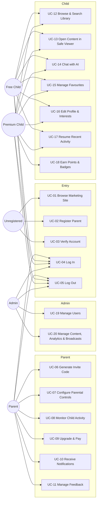

---

## UC-01: Browse Marketing Site

| Field | Value |
|-------|-------|
| **ID** | UC-01 |
| **Name** | Browse Marketing Site |
| **Primary Actor** | Unregistered User |
| **Stories Covered** | §10.1 (1–9); Parent 17 / Premium 25 (download link) |
| **Preconditions** | Visitor has opened `index.html`. |
| **Postconditions** | Visitor has seen plans, testimonials, features, app preview, safety, analytics, about, privacy, contact; can tap *Download on Google Play*. |
| **Main Flow** | 1. Visitor opens website. 2. Page renders hero + plans + features + "Inside the App" + safety + analytics + about + contact + privacy link. 3. Firestore snapshot on `feedback where status=published` streams live testimonials. 4. Visitor may tap *Google Play* to go to the app listing. |
| **Alt Flows** | 4a. Visitor clicks *Book Catalog* → `catalog.html` redirects to login prompt (UC-04). |
| **Exceptions** | 3a. Feedback listener error → placeholder card shown. |

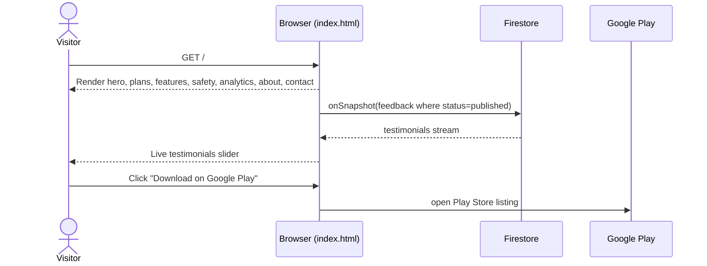

---

## UC-02: Register Parent Account

| Field | Value |
|-------|-------|
| **ID** | UC-02 |
| **Name** | Register Parent Account |
| **Primary Actor** | Unregistered User |
| **Stories Covered** | §10.1 (10) |
| **Preconditions** | Visitor is on the Register screen and selects *Parent*. |
| **Postconditions** | Firebase Auth user created; `users/{uid}` document with `accountType = PARENT`; verification email sent. |
| **Main Flow** | 1. Visitor submits name/email/password. 2. `AuthViewModel.signUpParent` → `AccountManager.signUpParent`. 3. Firebase Auth creates account. 4. `sendEmailVerification` fires. 5. `users/{uid}` written. 6. State → `EmailNotVerified` (→ UC-03). |
| **Alt Flows** | — |
| **Exceptions** | 3a. Email collision / weak password → mapped error; auth account rolled back if Firestore write fails. |

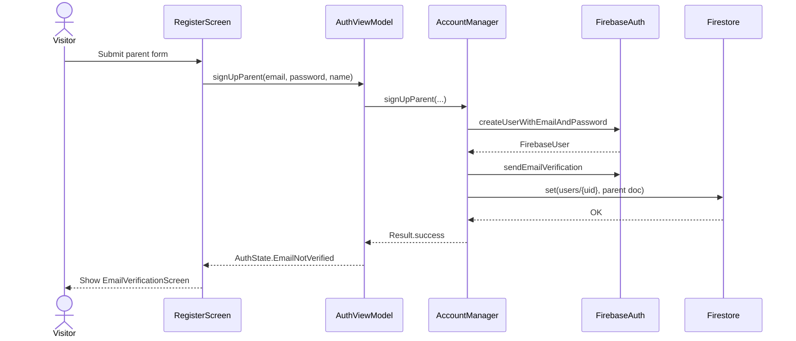

---

## UC-03: Verify Account

| Field | Value |
|-------|-------|
| **ID** | UC-03 |
| **Name** | Verify Account (Email Verification) |
| **Primary Actor** | Unregistered User → Registered Parent |
| **Stories Covered** | §10.1 (11) |
| **Preconditions** | Parent registered; verification email has been sent. |
| **Postconditions** | `FirebaseUser.isEmailVerified == true`; state → `Authenticated`. |
| **Main Flow** | 1. Parent clicks link in email → Firebase marks email verified. 2. Parent returns to app and taps *I've verified*. 3. `AuthViewModel.checkEmailVerified` reloads user. 4. If verified → `Authenticated`; route to Parent Dashboard. |
| **Alt Flows** | 2a. Parent taps *Resend* → `AccountManager.resendVerificationEmail`. |
| **Exceptions** | 3a. Still unverified → message "Email not yet verified." |

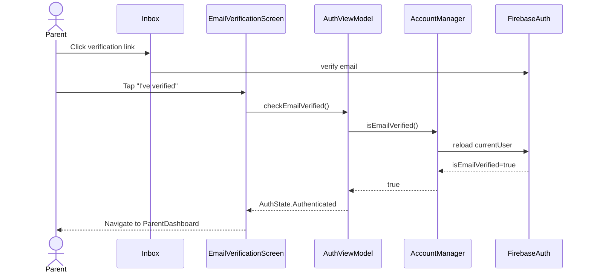

---

## UC-04: Log In

| Field | Value |
|-------|-------|
| **ID** | UC-04 |
| **Name** | Log In Securely |
| **Primary Actor** | Parent / Free Child / Premium Child / Admin |
| **Stories Covered** | §10.2 (1), §10.3 (1), §10.4 (1), §10.5 (1) |
| **Preconditions** | Actor has a registered, active account. |
| **Postconditions** | `AuthState.Authenticated`; `_currentUser` populated; routed to the correct home screen. |
| **Main Flow** | 1. Actor enters email + password. 2. `AuthViewModel.signIn` → `AccountManager.signIn`. 3. Firebase Auth signs in. 4. `trackLoginAttempt` records the attempt. 5. User doc loaded; routing: admin email → Admin; parent & unverified → Verification; else → Chat / Dashboard. |
| **Alt Flows** | 5a. Admin email bypasses email-verification gate. 5b. Status = `SUSPENDED/BANNED` → sign out + block message. |
| **Exceptions** | 3a. Invalid credentials → error + failed attempt logged. |

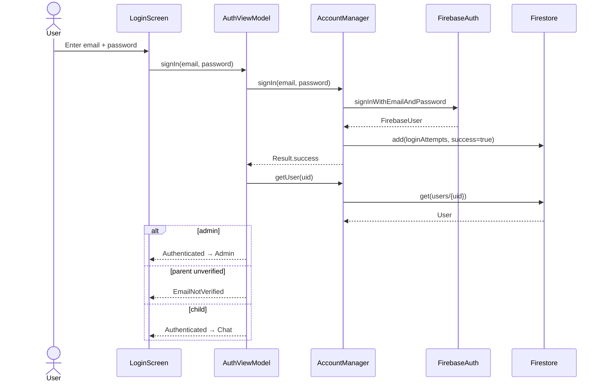

---

## UC-05: Log Out

| Field | Value |
|-------|-------|
| **ID** | UC-05 |
| **Name** | Log Out Securely |
| **Primary Actor** | Any authenticated actor |
| **Stories Covered** | §10.2 (2), §10.3 (2), §10.4 (2), §10.5 (2) |
| **Preconditions** | Actor is authenticated. |
| **Postconditions** | Firebase session cleared; `_currentUser = null`; state → `Unauthenticated`; UI returns to Login. |
| **Main Flow** | 1. Actor taps Logout. 2. `AuthViewModel.signOut` clears state. 3. `AccountManager.signOut` → `FirebaseAuth.signOut`. 4. Navigation returns to Login. |
| **Alt Flows** | — |
| **Exceptions** | — |

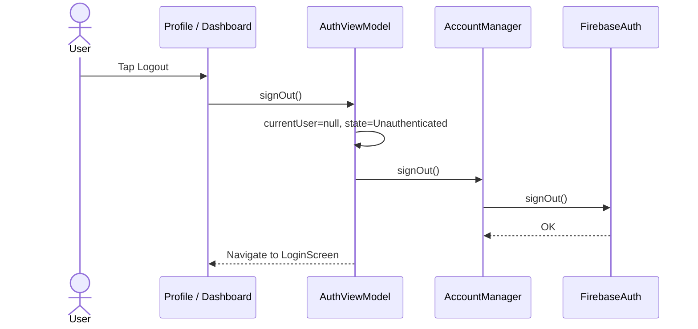

---

## UC-06: Generate Invite Code (Parent → Child)

| Field | Value |
|-------|-------|
| **ID** | UC-06 |
| **Name** | Generate 6-Digit Invite Code for a Child |
| **Primary Actor** | Registered Parent |
| **Secondary Actor** | Unregistered child (will register with the code) |
| **Stories Covered** | §10.2 (3) |
| **Preconditions** | Parent authenticated and email-verified. |
| **Postconditions** | `inviteCodes/{CODE}` document created with 24 h expiry; code shown to parent. Child can then register with the code. |
| **Main Flow** | 1. Parent taps *Generate Code*. 2. Parent optionally preselects interests and starter books. 3. `AccountManager.generateInviteCode` picks a unique 6-char code. 4. `inviteCodes/{CODE}` written with `parentId`, `expiresAt = now + 24h`, interests, starter books. 5. Code displayed. 6. Child later enters the code at registration → `signUpChild` validates code, creates child doc with `planType = PREMIUM, parentId = X`, marks code `used`. |
| **Alt Flows** | 3a. 5 collision retries fail → error. 6a. Code expired / already used → child signup rejected. |
| **Exceptions** | — |

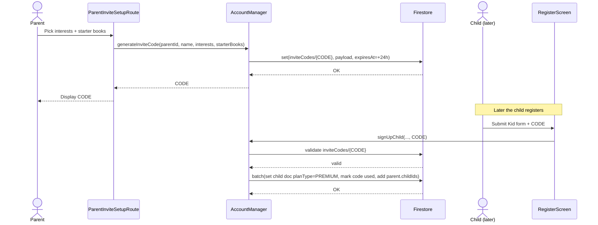

---

## UC-07: Configure Parental Controls

| Field | Value |
|-------|-------|
| **ID** | UC-07 |
| **Name** | Configure Parental Controls (Filters, Screen Time, Enforcement) |
| **Primary Actor** | Registered Parent |
| **Stories Covered** | §10.2 (4, 5, 6, 7, 8) |
| **Preconditions** | Parent authenticated with at least one linked child. |
| **Postconditions** | `users/{childId}.contentFilters.maxAgeRating`, `contentFilters.allowVideos`, `screenTimeConfig.dailyLimitMinutes` updated. When the child's daily limit is reached, `ScreenTimeWrapper` blocks further usage. |
| **Main Flow** | 1. Parent opens *Parental Controls* (after PIN check if set). 2. Parent adjusts max age rating, video toggle, daily screen-time limit. 3. `AccountManager.updateChildFilters` / direct update writes to `users/{childId}`. 4. On child's device, `ScreenTimeWrapper` listens to `screenTimeSessions` + `screenTimeConfig`; when today's minutes ≥ limit it shows a "Time's up" lock screen and disables navigation. |
| **Alt Flows** | 1a. Parent can also update `parentalPin` via `AccountManager.updateChildParentalPin`. |
| **Exceptions** | 2a. PIN not 4 digits → local validation error. |

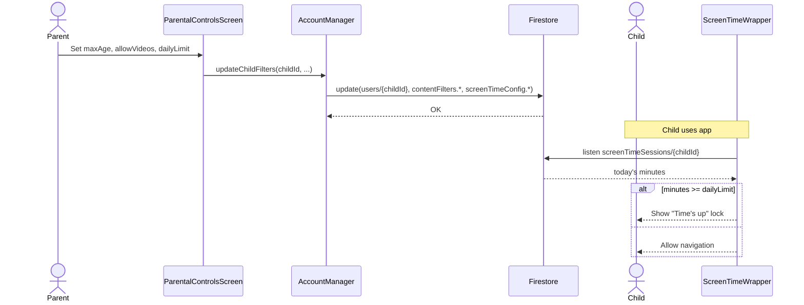

---

## UC-08: Monitor Child Activity

| Field | Value |
|-------|-------|
| **ID** | UC-08 |
| **Name** | Monitor Child Activity (History, Favourites, Chat, Reading Progress) |
| **Primary Actor** | Registered Parent |
| **Stories Covered** | §10.2 (9, 10, 11, 12) |
| **Preconditions** | Parent authenticated with linked child(ren). |
| **Postconditions** | Child's recent activity, favourites, chatbot transcripts, and reading progress are rendered live. |
| **Main Flow** | 1. Parent opens Dashboard. 2. `AccountManager.getChildrenFlow(parentId)` streams children. 3. Parent picks a child. 4. Parallel streams: `readingHistory/{childId}/sessions` (history + progress), `favorites/{childId}/items` (favourites), `chatMessages/{childId}` (chatbot interactions). 5. UI renders tabs: Activity · Favourites · Chat · Progress. |
| **Alt Flows** | — |
| **Exceptions** | 4a. Firestore error → empty state per tab. |

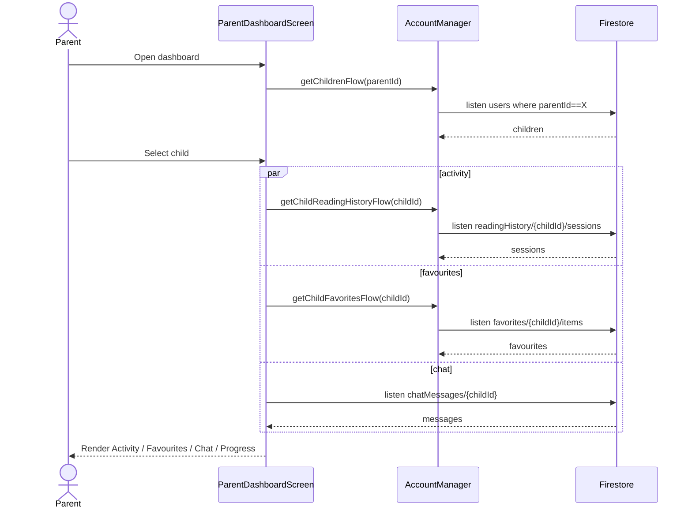

---

## UC-09: Upgrade to Premium & Manage Payment

| Field | Value |
|-------|-------|
| **ID** | UC-09 |
| **Name** | Upgrade a Child to Premium and Manage Payments |
| **Primary Actor** | Registered Parent |
| **Stories Covered** | §10.2 (13, 14) |
| **Preconditions** | Parent authenticated; target child is on FREE plan. |
| **Postconditions** | `users/{childId}.planType = PREMIUM`; Premium features unlock; payment recorded on Google Play. |
| **Main Flow** | 1. Parent taps *Upgrade*. 2. `PaymentScreen` → `BillingManager.launchBillingFlow`. 3. Google Play Billing handles payment. 4. On success, `AuthViewModel.upgradeCurrentUserToPremium` → `AccountManager.upgradeToPremium(childId)`. 5. Firestore update. 6. `_currentUser` reflects PREMIUM. |
| **Alt Flows** | 2a. Parent cancels billing dialog → state unchanged. |
| **Exceptions** | 4a. Firestore update fails → retried on next app open. |

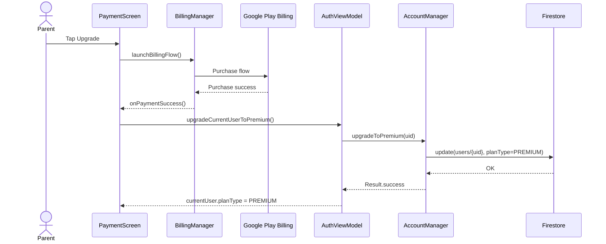

---

## UC-10: Receive Notifications

| Field | Value |
|-------|-------|
| **ID** | UC-10 |
| **Name** | Receive Notifications (Screen-Limit, Announcements, Alerts) |
| **Primary Actor** | Registered Parent (primary), any signed-in user (general) |
| **Stories Covered** | §10.2 (15) |
| **Preconditions** | User is authenticated; FCM token stored on `users/{uid}.fcmToken`. |
| **Postconditions** | `notifications/{uid}/items/{id}` inserted; UI shows `AnnouncementDialog`; after dismissal `read = true`. |
| **Main Flow** | 1. Event fires (e.g. child reaches screen-time limit; admin broadcast). 2. Cloud Function / Admin writes `notifications/{uid}/items/{id}`. 3. `NotificationsViewModel` snapshot updates. 4. `AnnouncementDialog` shows unread announcements. 5. User taps *Got it!* → `markRead`. |
| **Alt Flows** | 1a. Device receives FCM push while app is backgrounded. |
| **Exceptions** | 3a. Listener error → silent retry. |

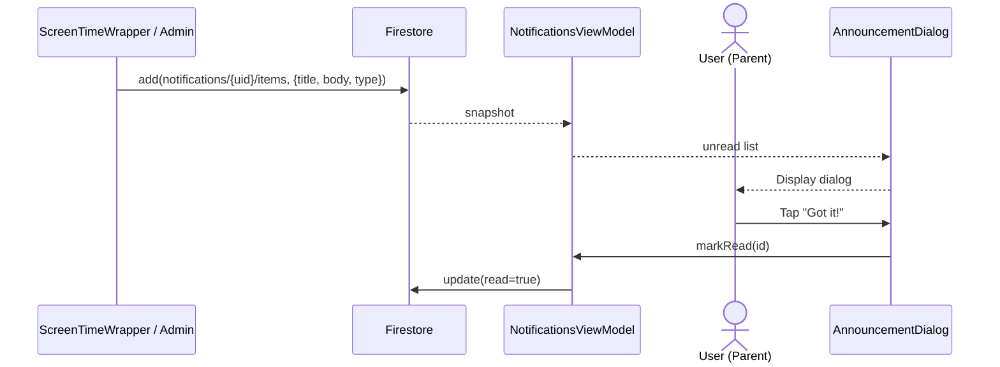

---

## UC-11: Submit and Manage Feedback

| Field | Value |
|-------|-------|
| **ID** | UC-11 |
| **Name** | Submit or Manage Own Feedback |
| **Primary Actor** | Any signed-in user (Parent emphasised per §10.2 (16)); website users via `/feedback.html` |
| **Stories Covered** | §10.2 (16); related to Child feedback from UC-14 |
| **Preconditions** | User authenticated. |
| **Postconditions** | `feedback/{id}` doc created / edited / deleted; live feedback slider on home page updates via snapshot. |
| **Main Flow** | 1. User opens Feedback page. 2. Enters rating (1–5) + comment; writes `feedback/{id}` with `userId, status = "published", source`. 3. To edit: fetch own doc → update. 4. To delete: `deleteDoc(feedback/{id})` (allowed when `userId == currentUser.uid` or admin). |
| **Alt Flows** | 4a. Admin can delete any feedback (UC-20). |
| **Exceptions** | 2a. Write error → inline message. |

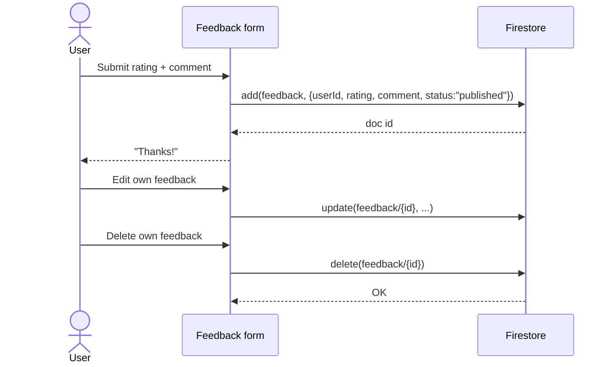

---

## UC-12: Browse, Search & Filter Book Library

| Field | Value |
|-------|-------|
| **ID** | UC-12 |
| **Name** | Browse, Search and Filter the Book Library |
| **Primary Actor** | Free Child, Premium Child |
| **Stories Covered** | §10.3 (3, 16, 17); §10.4 (3, 16, 17) |
| **Preconditions** | Child authenticated. |
| **Postconditions** | Filtered, paginated list of books rendered. |
| **Main Flow** | 1. Child opens *Library*. 2. Child types a search term / picks category / age / difficulty. 3. `LibraryViewModel.loadBooks(reset)` queries `content_books` with `where(category/difficulty) + orderBy(title) + limit(20)`. 4. Client-side title and age filtering applied. 5. *Load More* uses `startAfter(lastDoc)`. |
| **Alt Flows** | — |
| **Exceptions** | 3a. No results → "No books found." 3b. Query error → no-results fallback. |

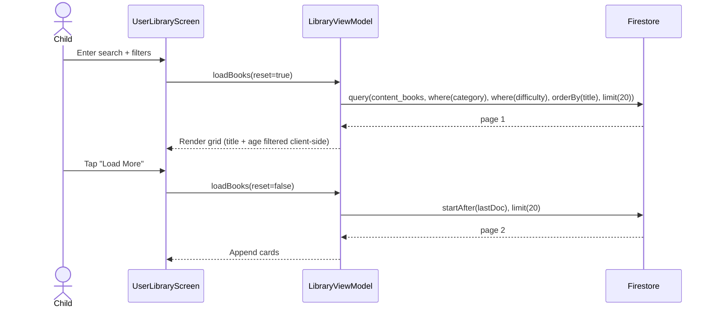

---

## UC-13: Open Content in Safe Viewer

| Field | Value |
|-------|-------|
| **ID** | UC-13 |
| **Name** | Open a Book or Video in the In-App Safe Viewer |
| **Primary Actor** | Free Child, Premium Child |
| **Stories Covered** | §10.3 (4, 5); §10.4 (4, 5) |
| **Preconditions** | Child tapped a recommendation / catalog card / favourite. |
| **Postconditions** | Content rendered inside the app; drop-off duration tracked on close. |
| **Main Flow** | 1. Child taps a card. 2. `buildContentRoute` classifies URL: known book host → `BookReaderScreen`; YouTube → `YouTubePlayerScreen`; else → `SafeWebViewScreen`. 3. `ProfileViewModel.trackReading` records the open event. 4. On close, `AnalyticsRepository.trackDropOffPoint(itemId, uid, openedAt, closedAt, seconds)`. |
| **Alt Flows** | 2a. Blank URL → pop back stack. |
| **Exceptions** | — |

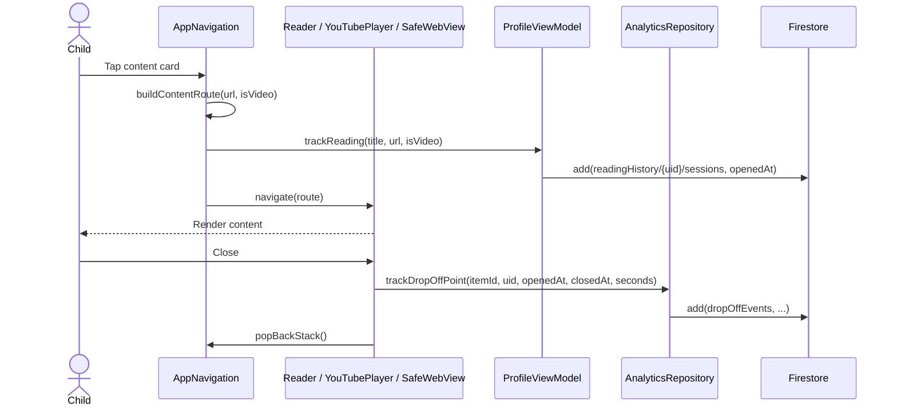

---

## UC-14: Chat with AI Assistant

| Field | Value |
|-------|-------|
| **ID** | UC-14 |
| **Name** | Chat with the AI Assistant (TTS, New Chat, History) |
| **Primary Actor** | Free Child, Premium Child |
| **Stories Covered** | §10.3 (6, 7, 8, 9); §10.4 (6, 7, 8, 9) |
| **Preconditions** | Child authenticated. For Free: daily quota of 5 not exhausted. |
| **Postconditions** | Chat message + bot reply rendered; messages persisted in `chatMessages/{uid}`; TTS speaks replies on demand. |
| **Main Flow** | 1. Child types a prompt / taps a chip / taps *New Chat*. 2. `ChatViewModel.send` checks `ChatQuotaManager.canSend(uid, plan)`. 3. Allowed → query recommendation engine / `content_books`. 4. Persist user + bot messages in `chatMessages/{uid}`. 5. Child taps the TTS icon → `TextToSpeechService.speak(text)`. 6. Child can scroll history, which is loaded on screen open. |
| **Alt Flows** | 2a. Free quota exhausted → message + upgrade prompt. 1a. *New Chat* opens a new session id. |
| **Exceptions** | 3a. No results → fallback reply. |

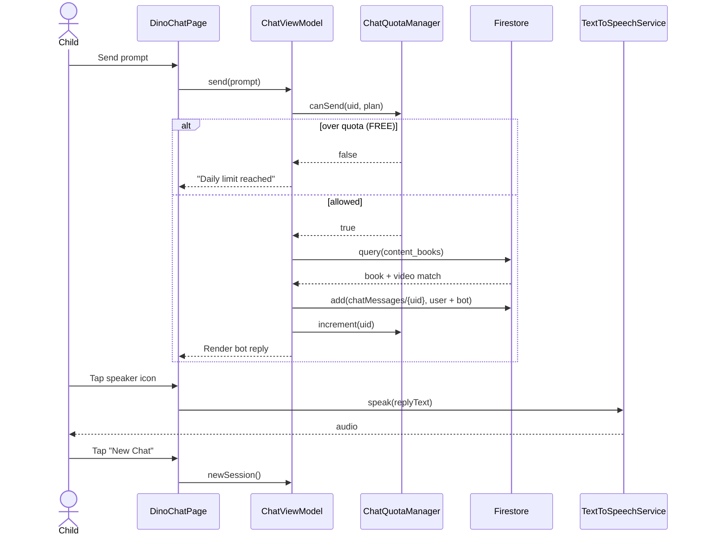

---

## UC-15: Manage Favourites

| Field | Value |
|-------|-------|
| **ID** | UC-15 |
| **Name** | Add or Remove a Favourite Book/Video |
| **Primary Actor** | Free Child, Premium Child |
| **Stories Covered** | §10.3 (10, 11); §10.4 (10, 11) |
| **Preconditions** | Child authenticated. |
| **Postconditions** | Item added/removed at `favorites/{uid}/items/{itemId}`. |
| **Main Flow** | 1. Child taps ♥ on a card. 2. `FavoritesViewModel.toggle(item)`. 3. If adding and plan = FREE, check count vs. limit (2 books, 2 videos). 4. Write / delete Firestore doc. 5. Snapshot listener refreshes UI. |
| **Alt Flows** | — |
| **Exceptions** | 3a. Over free limit → upgrade prompt, no write. |

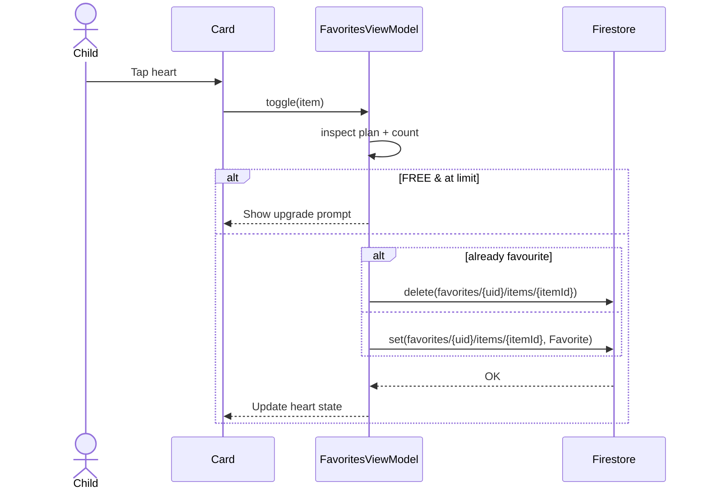

---

## UC-16: Edit Profile, Interests & Reading Level

| Field | Value |
|-------|-------|
| **ID** | UC-16 |
| **Name** | Edit Profile, Interests and Reading Level |
| **Primary Actor** | Free Child, Premium Child |
| **Stories Covered** | §10.3 (12, 13, 14); §10.4 (12, 13, 14) |
| **Preconditions** | Child authenticated. |
| **Postconditions** | `users/{uid}` updated (name, age, interests, readingLevel). Future recommendations use the new values. |
| **Main Flow** | 1. Child opens Profile → *Edit*. 2. Child edits fields: name, age, interests chips, reading level chips. 3. `ProfileViewModel.saveProfile` → `AccountManager.updateUser(user)`. 4. Firestore `set(users/{uid}, updated)`. 5. `_currentUser` stream refreshes; chatbot and library use the new values. |
| **Alt Flows** | — |
| **Exceptions** | 3a. Write failure → toast; form stays open. |

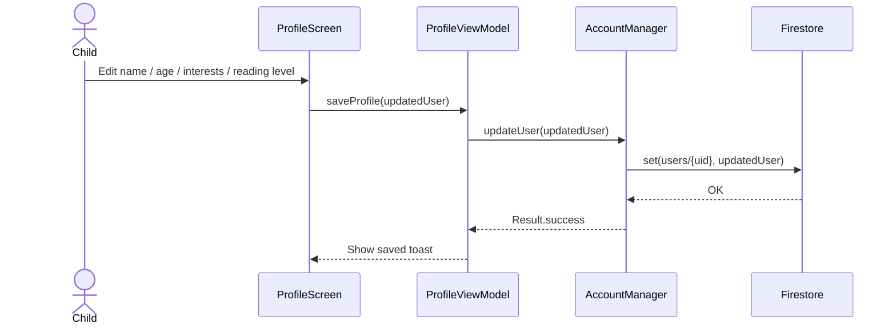

---

## UC-17: Resume Recent Activity / Continue Reading

| Field | Value |
|-------|-------|
| **ID** | UC-17 |
| **Name** | View Recent Activity and Continue From Where I Left Off |
| **Primary Actor** | Free Child, Premium Child |
| **Stories Covered** | §10.3 (15, 18); §10.4 (15, 18) |
| **Preconditions** | Child authenticated and has read/watched something before. |
| **Postconditions** | Most recent session resumed in its viewer at (or near) the last position. |
| **Main Flow** | 1. Child opens *Profile* or the *Continue* rail on Chat home. 2. `ProfileViewModel.loadRecent()` queries `readingHistory/{uid}/sessions` ordered by `openedAt desc`. 3. List rendered. 4. Child taps an entry → `buildContentRoute` reopens it in the safe viewer (UC-13). |
| **Alt Flows** | — |
| **Exceptions** | 2a. No history → "Nothing yet" placeholder. |

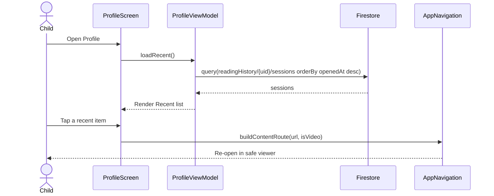

---

## UC-18: Earn Points, Badges & View Progress (Premium)

| Field | Value |
|-------|-------|
| **ID** | UC-18 |
| **Name** | Earn Points, Levels, Badges and View Progress Dashboard |
| **Primary Actor** | Premium Registered Child |
| **Stories Covered** | §10.4 (19, 20, 21, 22, 23, 24) |
| **Preconditions** | Child is on Premium. |
| **Postconditions** | `gamificationProfile/{uid}` updated (points, level, streak); `badgeUnlocks/{uid}/{badgeId}` may be created; books/videos marked finished / watched; personalised top-picks re-computed. |
| **Main Flow** | 1. Premium child performs a completion action (mark book *Finished*, mark video *Watched*, complete reading session). 2. `GamificationRepository.onEvent(uid, event)` updates points/level and writes `learningProgressEvents`. 3. If milestone reached, create `BadgeUnlock`. 4. `DinoChatPage` / Library shows *Personalised Top Picks* with a relevance score computed from profile interests, reading level, and history. 5. Child opens *Progress Dashboard* to see points, level, streak, badges. |
| **Alt Flows** | 1a. Free child attempts to open Badges screen → navigation pops back (Premium-only gate in `AppNavigation`). |
| **Exceptions** | — |

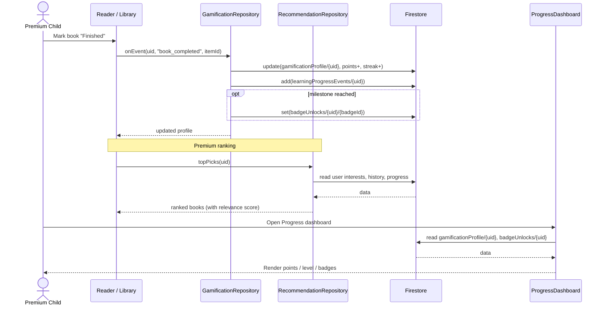

---

## UC-19: Admin — Manage Users

| Field | Value |
|-------|-------|
| **ID** | UC-19 |
| **Name** | Admin Manages Users (View, Search, Filter, Suspend, Ban, Delete, View Activity) |
| **Primary Actor** | System Admin |
| **Stories Covered** | §10.5 (3, 4, 5, 6, 7, 8) |
| **Preconditions** | Admin authenticated. |
| **Postconditions** | Target user's `status` updated or user deleted. `users/{uid}` reflects change; affected user is signed out on next load. |
| **Main Flow** | 1. Admin opens *Users* tab. 2. `AdminViewModel` streams `users` collection. 3. Admin types a search term or picks a filter (plan, status). 4. Admin selects a user → *Suspend* / *Ban* / *Delete*. 5. `AdminViewModel.updateStatus` or `deleteUser`. 6. Firestore update / delete. Optionally, Auth account deleted via Cloud Function. 7. Admin views full activity: reading history, favourites, chat messages, login attempts. |
| **Alt Flows** | 4a. *Reinstate* → `status = ACTIVE`. |
| **Exceptions** | 6a. Delete fails → error toast. |

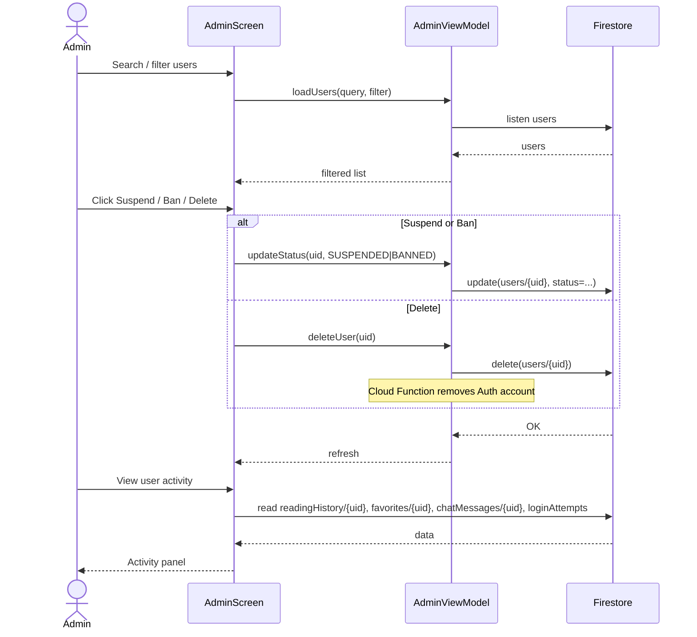

---

## UC-20: Admin — Manage Content, Analytics & Broadcasts

| Field | Value |
|-------|-------|
| **ID** | UC-20 |
| **Name** | Admin Manages Content, Categories, Analytics, Notifications & Feedback |
| **Primary Actor** | System Admin |
| **Stories Covered** | §10.5 (9, 10, 11, 12, 13, 14, 15, 16, 17, 18) |
| **Preconditions** | Admin authenticated. |
| **Postconditions** | `content_books`, `bookCategories`, `feedback`, `notifications` updated; analytics dashboard refreshed. |
| **Main Flow (content)** | 1. Admin opens *Content*. 2. Searches books. 3. Adds a book → `set(content_books/{id}, book)`. 4. Edits → `update(content_books/{id}, ...)`. 5. Removes → `delete(content_books/{id})`. 6. Manages interest categories under `bookCategories`. |
| **Main Flow (analytics)** | 7. Admin opens *Analytics*. `AnalyticsRepository` aggregates registration rate, active users, drop-off, plan distribution. 8. Admin taps *Refresh* → re-query. |
| **Main Flow (notifications)** | 9. Admin writes a broadcast (all / parents / children / premium). 10. `AdminViewModel.broadcast` fans out `notifications/{uid}/items`. |
| **Main Flow (feedback)** | 11. Admin reviews feedback; can delete inappropriate items → `delete(feedback/{id})`. |
| **Alt Flows** | 3a. Validation fails → inline error. |
| **Exceptions** | 9a. Large audience → chunked batch commits. |

```mermaid
sequenceDiagram
    actor A as Admin
    participant AS as AdminScreen
    participant AVM as AdminViewModel
    participant AR as AnalyticsRepository
    participant FS as Firestore

    Note over A,FS: Content management
    A->>AS: Add / Edit / Remove book
    AS->>AVM: saveBook / deleteBook
    AVM->>FS: set / update / delete content_books/{id}
    AS->>AVM: save category
    AVM->>FS: set(bookCategories/{id}, ...)

    Note over A,FS: Analytics
    A->>AS: Open Analytics (+ Refresh)
    AS->>AR: loadAnalytics()
    AR->>FS: aggregate users, dropOffEvents, feedback
    FS-->>AR: data
    AR-->>AS: dashboard stats

    Note over A,FS: Broadcast
    A->>AS: Compose announcement
    AS->>AVM: broadcast(title, body, audience)
    AVM->>FS: query users by audience
    loop each uid
        AVM->>FS: add(notifications/{uid}/items, announcement)
    end

    Note over A,FS: Feedback moderation
    A->>AS: Delete feedback
    AS->>FS: delete(feedback/{id})
    FS-->>AS: OK
```

---

## Class Diagram

Firestore-backed domain entities plus the key services and view models used across the app.

```mermaid
classDiagram
    class User {
        +String id
        +String name
        +String email
        +int age
        +PlanType planType
        +AccountType accountType
        +UserStatus status
        +String? parentId
        +List~String~ childIds
        +List~String~ interests
        +String readingLevel
        +String? parentalPin
        +String? fcmToken
        +boolean isGuest
        +Timestamp createdAt
    }

    class ContentFilters {
        +int maxAgeRating
        +List~String~ blockedTopics
        +boolean allowVideos
    }

    class ScreenTimeConfig {
        +int dailyLimitMinutes
        +boolean isEnabled
        +int warningThresholdMinutes
    }

    class Book {
        +String id
        +String title
        +String author
        +int ageMin
        +int ageMax
        +String category
        +String difficultyLevel
        +String bookUrl
        +String coverUrl
        +String youtubeUrl
        +boolean isVideo
        +boolean isKidSafe
        +boolean canPlayInApp
        +List~String~ tags
    }

    class BookCategory {
        +String id
        +String name
        +String iconUrl
    }

    class Favorite {
        +String itemId
        +RecommendationType type
        +String title
        +String description
        +String imageUrl
        +String url
        +Timestamp addedAt
    }

    class ChatMessage {
        +String id
        +String sessionId
        +String userId
        +String role
        +String content
        +String? ttsAudioUrl
        +Timestamp sentAt
    }

    class ReadingHistory {
        +String itemId
        +String title
        +String coverUrl
        +boolean isVideo
        +int progressPercent
        +Timestamp openedAt
        +Timestamp closedAt
        +int durationSeconds
    }

    class ScreenTimeSession {
        +String sessionId
        +String userId
        +Timestamp startedAt
        +Timestamp endedAt
        +int minutes
    }

    class InviteCode {
        +String code
        +String parentId
        +String parentName
        +Timestamp createdAt
        +Timestamp expiresAt
        +boolean used
        +List~String~ childInterests
        +List~StarterBookSeed~ starterBooks
    }

    class StarterBookSeed {
        +String id
        +String title
        +String author
        +String coverUrl
        +String readerUrl
        +String bookUrl
    }

    class Feedback {
        +String id
        +String userId
        +String userName
        +int rating
        +String comment
        +String contentType
        +String contentTitle
        +String status
        +String source
        +Timestamp createdAt
    }

    class UserNotification {
        +String id
        +String type
        +String title
        +String body
        +boolean read
        +Timestamp createdAt
    }

    class LoginAttempt {
        +String userId
        +String email
        +boolean success
        +String failureReason
        +Timestamp timestamp
    }

    class GamificationProfile {
        +String userId
        +int points
        +int level
        +int streakDays
        +int booksFinished
        +int videosWatched
    }

    class BadgeUnlock {
        +String badgeId
        +String userId
        +Timestamp unlockedAt
    }

    class LearningProgressEvent {
        +String userId
        +String itemId
        +String eventType
        +Timestamp at
    }

    class PlanType {
        <<enumeration>>
        FREE
        PREMIUM
        ADMIN
    }
    class AccountType {
        <<enumeration>>
        PARENT
        CHILD
    }
    class UserStatus {
        <<enumeration>>
        ACTIVE
        SUSPENDED
        BANNED
    }
    class RecommendationType {
        <<enumeration>>
        BOOK
        VIDEO
    }

    class AccountManager {
        +signIn(email, password)
        +signUpParent(email, password, name)
        +signUpFreeKid(email, password, name, age, interests, level)
        +signUpChild(email, password, name, age, interests, level, code)
        +generateInviteCode(parentId, name, interests, starterBooks)
        +validateInviteCode(code)
        +updateChildFilters(childId, maxAge, allowVideos)
        +updateChildParentalPin(childId, pin)
        +upgradeToPremium(uid)
        +getChildrenFlow(parentId)
        +getChildFavoritesFlow(childId)
        +getChildReadingHistoryFlow(childId)
        +updateUser(user)
        +signOut()
    }

    class AuthViewModel {
        +signIn(email, password)
        +signUpParent(...)
        +signUpFreeKid(...)
        +signUpChild(...)
        +checkEmailVerified()
        +upgradeCurrentUserToPremium()
        +signOut()
    }

    class ChatViewModel {
        +send(prompt)
        +newSession()
        +loadHistory()
    }
    class LibraryViewModel {
        +loadBooks(reset)
        +applyFilters(query, category, age, difficulty)
    }
    class FavoritesViewModel {
        +toggle(item)
        +loadFavorites()
    }
    class ProfileViewModel {
        +saveProfile(user)
        +loadRecent()
        +trackReading(title, url, coverUrl, isVideo)
    }
    class NotificationsViewModel {
        +startListening(uid)
        +markRead(uid, id)
    }
    class AdminViewModel {
        +loadUsers(query, filter)
        +updateStatus(uid, status)
        +deleteUser(uid)
        +saveBook(book)
        +deleteBook(id)
        +saveCategory(category)
        +broadcast(title, body, audience)
    }
    class ParentDashboardViewModel {
        +selectChild(childId)
        +listenChildFavorites()
        +listenChildHistory()
        +listenChildChat()
    }

    class ChatQuotaManager {
        +canSend(uid, plan) boolean
        +increment(uid)
    }
    class BillingManager {
        +launchBillingFlow()
        +onPurchaseResult(purchase)
    }
    class AnalyticsRepository {
        +trackDropOffPoint(itemId, userId, openedAt, closedAt, seconds)
        +loadDashboard()
    }
    class GamificationRepository {
        +onEvent(uid, eventType, itemId)
    }
    class RecommendationRepository {
        +topPicks(uid)
        +personalizedFor(prompt, uid)
    }
    class TextToSpeechService {
        +speak(text)
        +stop()
    }
    class ScreenTimeWrapper {
        +observeUsage(uid)
        +enforceLimit(config)
    }

    User --> "1" ContentFilters
    User --> "1" ScreenTimeConfig
    User --> PlanType
    User --> AccountType
    User --> UserStatus
    User "1" -- "0..*" User : parent > children
    User "1" -- "0..*" Favorite
    User "1" -- "0..*" ChatMessage
    User "1" -- "0..*" ReadingHistory
    User "1" -- "0..*" ScreenTimeSession
    User "1" -- "0..*" UserNotification
    User "1" -- "0..*" LoginAttempt
    User "1" -- "0..*" InviteCode : issued (parent)
    User "1" -- "1" GamificationProfile
    User "1" -- "0..*" BadgeUnlock
    User "1" -- "0..*" LearningProgressEvent
    InviteCode "1" -- "0..*" StarterBookSeed
    Favorite --> RecommendationType
    Feedback --> Book : refers to
    Book --> BookCategory

    AuthViewModel --> AccountManager
    ChatViewModel --> ChatQuotaManager
    ChatViewModel --> RecommendationRepository
    ChatViewModel --> TextToSpeechService
    LibraryViewModel --> Book
    FavoritesViewModel ..> Favorite
    ProfileViewModel --> AccountManager
    ProfileViewModel --> AnalyticsRepository
    NotificationsViewModel ..> UserNotification
    AdminViewModel --> AccountManager
    AdminViewModel --> AnalyticsRepository
    ParentDashboardViewModel --> AccountManager
    ScreenTimeWrapper --> ScreenTimeConfig
    ScreenTimeWrapper --> ScreenTimeSession
    GamificationRepository --> GamificationProfile
    GamificationRepository --> BadgeUnlock
    GamificationRepository --> LearningProgressEvent
    BillingManager ..> User
```

---

## Notes on Mermaid Rendering

- GitHub renders all diagrams above natively.
- In VS Code, install *Markdown Preview Mermaid Support*.
- For PNG/SVG export, paste individual diagrams into [mermaid.live](https://mermaid.live).
